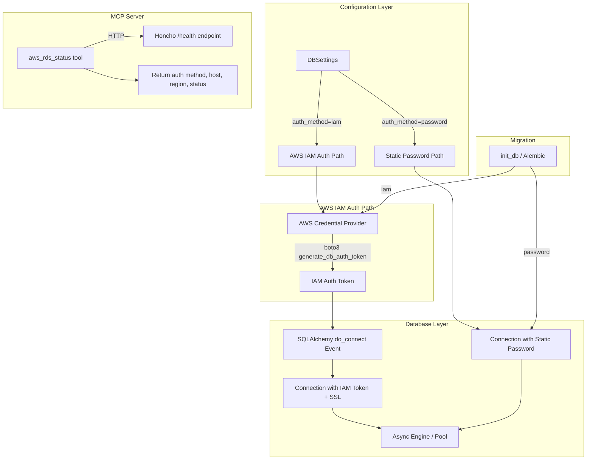

# Design Document: AWS MCP Postgres

## Overview

This design adds AWS IAM authentication support for connecting Honcho's PostgreSQL database to an AWS RDS instance, and introduces an MCP server tool for monitoring RDS connectivity status. The feature enables operators to replace static database passwords with short-lived IAM authentication tokens, leveraging AWS IAM policies for access control.

The implementation touches three main areas:
1. **Configuration** (`src/config.py`): New `DBSettings` fields for IAM auth method and AWS RDS parameters
2. **Database Engine** (`src/db.py`): SQLAlchemy event-based token injection for IAM connections, SSL enforcement, and pool tuning
3. **MCP Server** (`mcp/src/tools/`): New `aws_rds_status` tool registered alongside existing tools

The design preserves full backward compatibility — when `DB_AUTH_METHOD` is `password` (the default), behavior is identical to today.

## Architecture



### Key Design Decisions

1. **Event-based token injection via `do_connect`**: Rather than modifying the connection URI on a timer, we use SQLAlchemy's `do_connect` event to generate a fresh IAM token for every new physical connection. This avoids token expiry races entirely — each connection gets a token at creation time.

2. **boto3 for credential management**: We use `boto3`'s `generate_db_auth_token` which handles the SigV4 signing internally. This automatically supports all AWS credential sources (env vars, instance profiles, ECS task roles, EKS pod service accounts) without custom code.

3. **SSL enforcement for IAM**: AWS RDS IAM auth requires SSL. When `auth_method=iam`, the engine forces `sslmode=require` and optionally uses a custom CA bundle via `DB_RDS_SSL_CA_BUNDLE`.

4. **MCP tool calls health endpoint**: The `aws_rds_status` tool calls the Honcho API `/health` endpoint rather than directly probing the database. This keeps the MCP server stateless and uses the existing health check infrastructure.

## Components and Interfaces

### 1. `DBSettings` (src/config.py)

Extended with new fields:

```python
class DBSettings(HonchoSettings):
    model_config = SettingsConfigDict(env_prefix="DB_", extra="ignore")

    # Existing fields unchanged...
    
    # New IAM auth fields
    AUTH_METHOD: Literal["password", "iam"] = "password"
    AWS_REGION: str | None = None
    RDS_HOSTNAME: str | None = None
    RDS_PORT: int = 5432
    RDS_USERNAME: str | None = None
    AWS_PROFILE: str | None = None
    RDS_SSL_CA_BUNDLE: str | None = None
```

Validation: When `AUTH_METHOD` is `iam`, the model validator ensures `AWS_REGION`, `RDS_HOSTNAME`, `RDS_PORT`, and `RDS_USERNAME` are all set, raising a `ValueError` at startup if any are missing.

### 2. AWS Credential Provider (src/aws_auth.py)

A module providing a single function:

```python
def generate_rds_auth_token(
    region: str,
    hostname: str,
    port: int,
    username: str,
    profile: str | None = None,
) -> str:
    """Generate a short-lived IAM auth token for RDS connection."""
```

Uses `boto3.Session` (with optional profile) to call `client.generate_db_auth_token()`. Raises a descriptive error on failure (missing credentials, network issues, insufficient IAM permissions).

### 3. Database Engine Setup (src/db.py)

When `DB_AUTH_METHOD=iam`:
- Constructs a base connection URI from `RDS_HOSTNAME`, `RDS_PORT`, `RDS_USERNAME` (no password in URI)
- Registers a `do_connect` event listener that generates a fresh IAM token and injects it into `cparams`
- Forces `pool_pre_ping=True` and `pool_recycle <= 900`
- Adds SSL connect args (`sslmode=require`, optional `sslrootcert`)

When `DB_AUTH_METHOD=password`:
- Behavior is identical to current implementation

### 4. MCP `aws_rds_status` Tool (mcp/src/tools/aws-status.ts)

New tool registered in the MCP server:

```typescript
interface AwsRdsStatusResult {
  auth_method: "password" | "iam";
  rds_hostname: string | null;
  rds_port: number | null;
  aws_region: string | null;
  connection_healthy: boolean;
  error: string | null;
}
```

The tool calls the Honcho API `/health` endpoint using the existing `Honcho` client and returns connectivity status along with configuration metadata. Since the MCP server communicates with Honcho via its SDK/API, the auth method and RDS details would need to be exposed via a new lightweight API endpoint or passed as configuration. The simplest approach: add a `/health/db` endpoint to the Honcho API that returns the auth method and connection info, which the MCP tool calls.

### 5. Migration Support (src/db.py - init_db)

The `init_db()` function is updated to construct an IAM-authenticated connection URI for Alembic when `DB_AUTH_METHOD=iam`. Since Alembic runs synchronously, we generate the token before invoking `command.upgrade()` and pass the constructed URI via `alembic_cfg.set_main_option("sqlalchemy.url", ...)`.

### 6. Docker / Deployment Updates

- **Dockerfile**: Add `RUN` step to download the AWS RDS CA bundle (`global-bundle.pem`) to a known path
- **docker-compose.yml.example**: Add commented-out section showing IAM auth config
- **.env.template**: Add documented entries for all new `DB_*` settings

## Data Models

No new database tables or schema changes are required. This feature only affects how the application authenticates to the database, not the data stored within it.

The only data structures introduced are:

| Structure | Location | Purpose |
|-----------|----------|---------|
| `DBSettings` extensions | `src/config.py` | New fields on existing Pydantic settings model |
| IAM auth token | Runtime only | Short-lived string (15 min max), never persisted |
| `AwsRdsStatusResult` | `mcp/src/tools/aws-status.ts` | Response shape for MCP tool |


## Correctness Properties

*A property is a characteristic or behavior that should hold true across all valid executions of a system — essentially, a formal statement about what the system should do. Properties serve as the bridge between human-readable specifications and machine-verifiable correctness guarantees.*

### Property 1: Token generation uses configured parameters

*For any* valid IAM configuration (region, hostname, port, username, optional profile), calling `generate_rds_auth_token` should invoke the underlying boto3 `generate_db_auth_token` with those exact parameter values.

**Validates: Requirements 1.1**

### Property 2: Fresh token injection on every connection

*For any* sequence of `do_connect` events when `auth_method=iam`, each event should result in a call to `generate_rds_auth_token` and the returned token should be set as the password in the connection parameters. No two consecutive connections should reuse a cached token.

**Validates: Requirements 1.2, 1.3, 4.1**

### Property 3: Password mode preserves existing behavior

*For any* `DBSettings` where `auth_method=password`, the engine should use the `CONNECTION_URI` value directly as the SQLAlchemy URL, with no `do_connect` event listener registered for token injection and no SSL enforcement beyond what the URI specifies.

**Validates: Requirements 1.4**

### Property 4: Token generation errors are descriptive

*For any* exception raised by the boto3 credential provider (e.g., `NoCredentialsError`, `ClientError`, `EndpointConnectionError`), the `generate_rds_auth_token` function should raise an error whose message includes the original exception type and a human-readable description of the failure.

**Validates: Requirements 1.5**

### Property 5: IAM mode enforces SSL

*For any* `DBSettings` where `auth_method=iam`, the engine's `connect_args` should include `sslmode=require`. If `RDS_SSL_CA_BUNDLE` is set, `sslrootcert` should equal that path.

**Validates: Requirements 1.6**

### Property 6: Auth method validation rejects invalid values

*For any* string value that is not `"password"` or `"iam"`, constructing `DBSettings` with that `AUTH_METHOD` should raise a validation error.

**Validates: Requirements 2.1**

### Property 7: IAM mode requires AWS fields with descriptive errors

*For any* `DBSettings` where `auth_method=iam` and at least one of `AWS_REGION`, `RDS_HOSTNAME`, `RDS_PORT`, or `RDS_USERNAME` is missing (None), construction should raise a validation error whose message identifies the specific missing field(s).

**Validates: Requirements 2.2, 2.5**

### Property 8: MCP status tool returns all required fields

*For any* response from the Honcho health endpoint (success or failure), the `aws_rds_status` tool result should contain all required fields: `auth_method`, `rds_hostname`, `rds_port`, `aws_region`, and `connection_healthy`.

**Validates: Requirements 3.1**

### Property 9: MCP status tool error includes failure reason

*For any* failed health check response, the `aws_rds_status` tool should return an error result whose message includes the failure reason from the health check.

**Validates: Requirements 3.3**

### Property 10: IAM mode forces pool_pre_ping

*For any* `DBSettings` where `auth_method=iam`, the engine should be configured with `pool_pre_ping=True` regardless of the `POOL_PRE_PING` setting value.

**Validates: Requirements 4.2**

### Property 11: IAM mode clamps pool_recycle

*For any* `DBSettings` where `auth_method=iam` and any `POOL_RECYCLE` value, the effective pool_recycle used by the engine should be `min(configured_value, 900)`.

**Validates: Requirements 4.3**

### Property 12: Pool settings preserved across auth methods

*For any* `DBSettings` with any `auth_method`, the engine's `pool_size`, `max_overflow`, and `pool_timeout` should equal the configured values from settings.

**Validates: Requirements 4.4**

### Property 13: Migration constructs IAM URI with fresh token

*For any* valid IAM configuration, when `init_db` runs with `auth_method=iam`, the connection URI passed to Alembic should contain the RDS hostname, port, username, and a freshly generated IAM token as the password component.

**Validates: Requirements 6.1**

### Property 14: Migration uses SSL config for IAM

*For any* IAM configuration with or without `RDS_SSL_CA_BUNDLE`, the Alembic connection should include the same SSL parameters as the main engine configuration.

**Validates: Requirements 6.2**

### Property 15: Migration token failure terminates with error

*For any* exception raised during IAM token generation within `init_db`, the function should propagate the error (resulting in a non-zero exit code) after logging a descriptive message.

**Validates: Requirements 6.3**

## Error Handling

### Token Generation Failures

When `generate_rds_auth_token` fails:
- **Missing credentials**: boto3 raises `NoCredentialsError` → wrapped with message explaining to check IAM role, env vars, or `DB_AWS_PROFILE`
- **Network error**: `EndpointConnectionError` → wrapped with message about network connectivity to STS/RDS endpoints
- **Insufficient permissions**: `ClientError` with access denied → wrapped with message about IAM policy requirements (`rds-db:connect`)
- All errors are logged at ERROR level with full context (region, hostname, username)

### Configuration Validation Failures

- Invalid `AUTH_METHOD` value → Pydantic `Literal` validation error at startup
- Missing required IAM fields → Custom `model_validator` raises `ValueError` naming the missing field(s)
- Invalid `RDS_SSL_CA_BUNDLE` path → Logged as warning; SSL still enforced with `sslmode=require` but without custom CA verification

### Connection Pool Failures

- Stale IAM token on existing connection → `pool_pre_ping` detects and discards; next checkout gets fresh connection with new token
- All pool connections exhausted → Standard SQLAlchemy `TimeoutError` (unchanged behavior)

### MCP Tool Failures

- Health endpoint unreachable → `aws_rds_status` returns `errorResult` with connection failure message
- Health endpoint returns error → Tool returns error result with HTTP status and response body

## Testing Strategy

### Unit Tests

Unit tests cover specific examples and edge cases:

- `DBSettings` construction with valid `password` config (no AWS fields needed)
- `DBSettings` construction with valid `iam` config (all required fields present)
- `DBSettings` construction with `iam` and missing `AWS_REGION` → validation error
- `DBSettings` construction with invalid `AUTH_METHOD` value → validation error
- `generate_rds_auth_token` with mocked boto3 → returns expected token string
- `generate_rds_auth_token` with mocked boto3 raising `NoCredentialsError` → descriptive error
- Engine creation in `password` mode → no `do_connect` listener, standard URI
- Engine creation in `iam` mode → `do_connect` listener registered, SSL args present
- `init_db` in `iam` mode with mocked token → Alembic receives correct URI
- MCP `aws_rds_status` tool with mocked healthy response → all fields present
- MCP `aws_rds_status` tool with mocked failed response → error result with reason

### Property-Based Tests

Property-based tests use `hypothesis` (Python) for the backend and `fast-check` (TypeScript) for the MCP server. Each test runs a minimum of 100 iterations and references its design property.

- **Property 1**: Generate random (region, hostname, port, username) tuples → verify boto3 called with exact values
  - Tag: `Feature: aws-mcp-postgres, Property 1: Token generation uses configured parameters`
- **Property 2**: Generate random sequences of connection events → verify each gets a unique fresh token
  - Tag: `Feature: aws-mcp-postgres, Property 2: Fresh token injection on every connection`
- **Property 3**: Generate random CONNECTION_URI strings → verify password mode passes them through unchanged
  - Tag: `Feature: aws-mcp-postgres, Property 3: Password mode preserves existing behavior`
- **Property 4**: Generate random boto3 exception types → verify error messages are descriptive
  - Tag: `Feature: aws-mcp-postgres, Property 4: Token generation errors are descriptive`
- **Property 5**: Generate random IAM configs with/without CA bundle → verify SSL args
  - Tag: `Feature: aws-mcp-postgres, Property 5: IAM mode enforces SSL`
- **Property 6**: Generate random non-password/non-iam strings → verify validation rejection
  - Tag: `Feature: aws-mcp-postgres, Property 6: Auth method validation rejects invalid values`
- **Property 7**: Generate random subsets of required IAM fields set to None → verify validation error names missing fields
  - Tag: `Feature: aws-mcp-postgres, Property 7: IAM mode requires AWS fields with descriptive errors`
- **Property 8**: Generate random health responses → verify tool result contains all required fields
  - Tag: `Feature: aws-mcp-postgres, Property 8: MCP status tool returns all required fields`
- **Property 9**: Generate random error responses → verify error result includes failure reason
  - Tag: `Feature: aws-mcp-postgres, Property 9: MCP status tool error includes failure reason`
- **Property 10**: Generate random POOL_PRE_PING values (true/false) with iam mode → verify pool_pre_ping is always True
  - Tag: `Feature: aws-mcp-postgres, Property 10: IAM mode forces pool_pre_ping`
- **Property 11**: Generate random POOL_RECYCLE values (1-7200) with iam mode → verify effective value is min(value, 900)
  - Tag: `Feature: aws-mcp-postgres, Property 11: IAM mode clamps pool_recycle`
- **Property 12**: Generate random pool settings with both auth methods → verify pool_size, max_overflow, pool_timeout preserved
  - Tag: `Feature: aws-mcp-postgres, Property 12: Pool settings preserved across auth methods`
- **Property 13**: Generate random valid IAM configs → verify Alembic URI contains hostname, port, username, and token
  - Tag: `Feature: aws-mcp-postgres, Property 13: Migration constructs IAM URI with fresh token`
- **Property 14**: Generate random IAM configs with/without CA bundle → verify Alembic SSL matches engine SSL
  - Tag: `Feature: aws-mcp-postgres, Property 14: Migration uses SSL config for IAM`
- **Property 15**: Generate random exceptions during init_db → verify error propagation with logging
  - Tag: `Feature: aws-mcp-postgres, Property 15: Migration token failure terminates with error`

### Testing Libraries

- **Python (backend)**: `pytest` + `hypothesis` for property-based testing
- **TypeScript (MCP)**: `vitest` + `fast-check` for property-based testing
- Each property-based test must run minimum 100 iterations
- Each test must include a comment tag: `Feature: aws-mcp-postgres, Property {N}: {title}`
