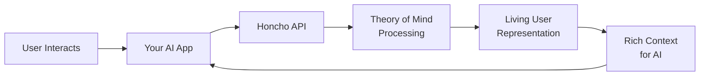

<Tip>📢 **Announcing Honcho Platform**: We've raised $5.35M pre-seed from Variant, White Star Capital & Betaworks to build the personal identity layer for AI. Access the hosted platform today!</Tip>

<Card title="Sign up to start using Honcho!" icon="rocket" href="https://app.honcho.dev">
    Start using the platform to manage Honcho instances for your workspace or app.
  </Card>

## Welcome to Honcho!

The Honcho Platform is a managed service and the easiest way to add personal memory and identity to your AI applications. Built by the team at Plastic Labs, Honcho enables **ambient personalization** - your AI learns about users automatically as they interact, with no surveys or additional user overhead.


## Why Use the Honcho Dashboard?

The Honcho management platform streamlines deployment and monitoring so you can focus on building great AI experiences:

**One-Click Deployment**: Launch dedicated Honcho instances in seconds with zero infrastructure setup. We handle provisioning, scaling, and maintenance automatically.

**Developer-First Tools**: Create and manage API keys, utilize an API playground with a Postman-like experience, get machine status and performance analytics of your Honcho instance.

**Production Monitoring**: Real-time analytics, usage metrics, and health monitoring. Track performance and user engagement across all your AI applications.


## Go to app.honcho.dev

Get up and running with Honcho in minutes through our managed platform:

### **1. Sign Up & Create Your Organization**
Start by creating your account and setting up your organization. Each organization gets isolated workspaces, team management, and dedicated infrastructure for your Honcho instances.

### **2. Deploy Your Honcho Instance**
One-click deployment creates a dedicated Honcho instance on Fly.io infrastructure. Your instance is automatically provisioned with PostgreSQL + pgvector, background workers, and API endpoints - ready to handle production traffic for your workspace.

### **3. Generate API Keys** 
Create and manage API keys for different environments (development, staging, production). Each key provides secure access to your Honcho instance with granular permissions and usage tracking.


### **4. Test with API Playground**
Use our Postman-like API playground to test queries, explore endpoints, and validate your integration. Send requests directly to your Honcho instance and see real-time responses with full request/response logging.


### **5. Monitor Performance & Machine Status**
Track your Honcho instance health, usage metrics, and performance analytics. Monitor API response times, background processing queues, memory usage, and user engagement across all your AI applications.


View the status of your machines running Honcho:


## What's Happening Under the Hood



**1. Users interact naturally** with your AI application  
**2. Honcho processes interactions via** using advanced theory of mind inference  
**3. Builds living representations** of each user's psychology, preferences, and identity  
**4. Provides rich context** to your AI when needed, in natural language


**Memory Engine Architecture**
- Hierarchical data storage (Workspaces → Peers / Sessions → Messages)
- Vector similarity search for semantic queries
- Metadata indexing for fast retrieval
- Automatic data organization and cleanup


```python
import honcho

# Initialize client
client = honcho.Client(api_key="your-api-key")

# Create a workspace for your app
workspace = client.workspaces.create(name="My AI App")

# Create a peer (user)
peer = client.peers.create(
    workspace_id=workspace.id,
    name="user_123"
)

# Get personalized context for AI response
context = client.dialectic.query(
    workspace_id=workspace.id,
    peer_id=peer.id,
    query="What communication style does this user prefer?"
)
# Returns rich, nuanced context about the user
```

## Getting Started

Check out our [Platform Guide](/documentation/platform/guided-tutorial) to start using Honcho platform quickly.

Or dive into our [API Reference](/api-reference) to explore all available endpoints.

## Next Steps

<CardGroup cols={2}>
  <Card title="Sign up to Honcho Platform" icon="rocket" href="https://app.honcho.dev">
    Get started with managed Honcho instances
  </Card>
  <Card title="Join our Discord" icon="discord" href="http://discord.gg/plasticlabs">
    Connect with 1000+ developers building with Honcho
  </Card>
  <Card title="Read the Docs" icon="book" href="/documentation/introduction/quickstart">
    Follow our comprehensive guides
  </Card>
  <Card title="Explore Examples" icon="code" href="/guides">
    See Honcho in action with real examples
  </Card>
</CardGroup>

We're excited to see what you'll build with Honcho Platform. Let's create smarter, more personalized AI experiences together!

---

*Ready to build personally aligned AI? [Get started with Honcho →](https://app.honcho.dev)*
