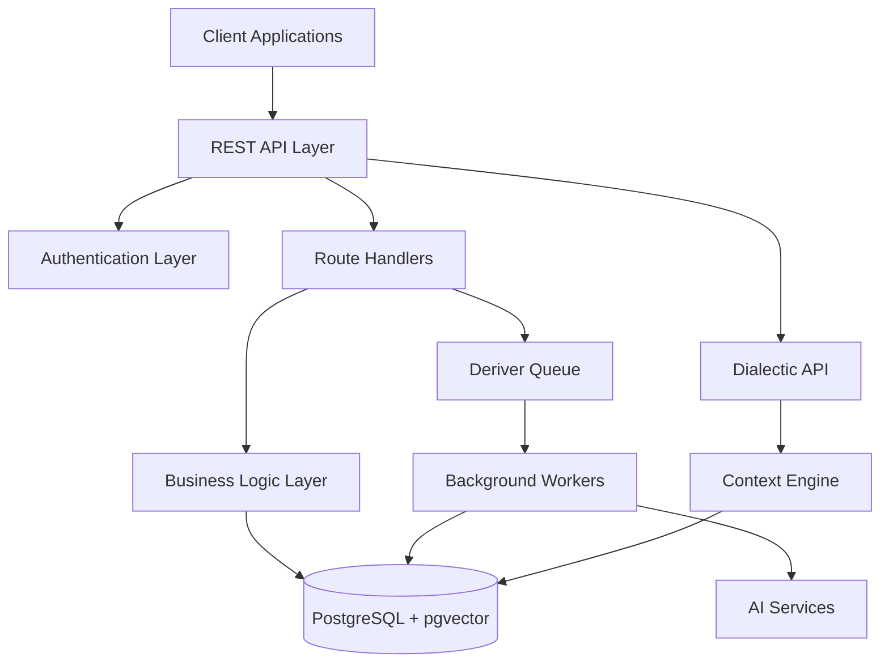

# Platform Overview

Honcho is a comprehensive memory management platform designed to power the next generation of AI applications. This overview covers the platform's key capabilities, architectural decisions, and how they work together to provide scalable memory management.

## Platform Architecture

### High-Level Components

### Core Services

**API Gateway**
- RESTful endpoints for all operations
- JWT-based authentication and authorization
- Request validation and error handling
- Rate limiting and throttling

**Memory Engine**
- Hierarchical data storage (Workspaces → Peers → Sessions → Messages)
- Vector similarity search for semantic queries
- Metadata indexing for fast retrieval
- Automatic data organization and cleanup

**Deriver System**
- Background processing queue for insight generation
- Scalable worker architecture
- Automatic retry and error handling
- Real-time status monitoring

**Dialectic Engine**
- Context-aware response generation
- Multi-source information synthesis
- Streaming and batch processing modes
- Customizable reasoning workflows

## Key Features

### Memory Management

**Persistent Storage**
- Store unlimited conversation history
- Maintain context across sessions and applications
- Organize information hierarchically
- Support for rich metadata and custom fields

**Intelligent Organization**
- Automatic categorization of interactions
- Temporal organization with timestamp indexing
- User-scoped collections for personalized data
- Cross-session context preservation

**Efficient Retrieval**
- Vector similarity search for semantic queries
- Full-text search for exact matches
- Hybrid search combining multiple strategies
- Real-time and batch query processing

### Background Processing

**Automatic Insight Generation**
- User personality and preference profiling
- Conversation summarization at multiple levels
- Fact extraction and knowledge building
- Behavioral pattern recognition

**Scalable Processing**
- Distributed worker architecture
- Queue-based job management
- Horizontal scaling capabilities
- Resource optimization and load balancing

**Intelligent Prioritization**
- Priority-based job scheduling
- Real-time vs. batch processing decisions
- Resource allocation based on importance
- Adaptive processing based on system load

### Contextual Intelligence

**Multi-Source Context**
- Combine conversation history, user profiles, and documents
- Cross-session context awareness
- Relationship mapping between entities
- Dynamic context window management

**Reasoning Capabilities**
- Logical inference from stored information
- Temporal reasoning about user changes
- Causal analysis of user behavior
- Predictive insights based on patterns

**Personalization Engine**
- Individual user modeling and adaptation
- Preference learning and evolution tracking
- Contextual response customization
- Experience optimization over time

## Technical Capabilities

### Data Storage

**PostgreSQL Foundation**
- ACID compliance for data integrity
- Advanced indexing for fast queries
- JSON support for flexible schemas
- Robust backup and recovery

**Vector Search**
- pgvector extension for embeddings
- Cosine similarity and other distance metrics
- Efficient similarity search at scale
- Support for multiple embedding models

**Performance Optimization**
- Connection pooling and caching
- Query optimization and indexing strategies
- Read replicas for scaling read operations
- Partitioning for large datasets

### Security & Privacy

**Authentication & Authorization**
- JWT-based token system
- Hierarchical access control (workspace/peer/session)
- API key management
- Role-based permissions

**Data Protection**
- Encryption at rest and in transit
- Workspace-level data isolation
- Audit logging for compliance
- GDPR-compliant data handling

**Privacy Controls**
- User consent management
- Data retention policies
- Selective data processing controls
- Anonymization capabilities

### Integration & APIs

**RESTful Design**
- Consistent API patterns across all endpoints
- Comprehensive error handling
- Standardized request/response formats
- OpenAPI specification for documentation

**SDK Support**
- Official Python and Node.js SDKs
- Type-safe interfaces with comprehensive documentation
- Async/await support for modern applications
- Framework-specific integrations

**Webhook Support** (Coming Soon)
- Event-driven architecture
- Real-time notifications
- Custom event filtering
- Reliable delivery guarantees

## Deployment Options

### Self-Hosted Deployment

**Container-Based**
- Docker and Docker Compose support
- Kubernetes Helm charts
- Multi-environment configurations
- Health checks and monitoring

**Cloud Platforms**
- AWS, GCP, Azure support
- Terraform infrastructure templates
- Auto-scaling configurations
- Managed service integrations

**Edge Deployment**
- Local development environments
- On-premises installations
- Hybrid cloud configurations
- Offline-capable modes

### Managed Services

**Honcho Cloud** (Coming Soon)
- Fully managed hosting
- Automatic scaling and updates
- Enterprise support and SLAs
- Global edge deployments

**Enterprise Features**
- SSO integration
- Advanced analytics
- Custom model support
- Dedicated infrastructure

## Performance Characteristics

### Scalability

**Horizontal Scaling**
- Stateless API servers for easy scaling
- Distributed worker architecture
- Database read replicas
- CDN integration for static assets

**Vertical Scaling**
- Efficient resource utilization
- Memory-optimized operations
- CPU-intensive task optimization
- Storage performance tuning

**Load Handling**
- Queue-based request buffering
- Intelligent load balancing
- Circuit breaker patterns
- Graceful degradation under load

### Latency & Throughput

**API Response Times**
- < 100ms for simple queries
- < 500ms for complex searches
- Streaming responses for large results
- Caching for frequently accessed data

**Processing Throughput**
- Thousands of messages per second
- Batch processing optimizations
- Parallel worker execution
- Adaptive processing strategies

**Storage Performance**
- Sub-second query responses
- Efficient indexing strategies
- Optimized vector operations
- Concurrent access handling

## Monitoring & Observability

### Metrics & Analytics

**System Metrics**
- API request rates and latencies
- Database performance indicators
- Queue depth and processing rates
- Worker health and utilization

**Business Metrics**
- User engagement patterns
- Feature usage analytics
- Processing success rates
- Error frequency and types

**Custom Metrics**
- Application-specific KPIs
- User behavior insights
- Performance benchmarks
- ROI measurement tools

### Logging & Debugging

**Structured Logging**
- JSON-formatted log entries
- Correlation IDs for request tracing
- Log level controls
- Centralized log aggregation

**Distributed Tracing**
- Request flow visualization
- Performance bottleneck identification
- Error propagation tracking
- Service dependency mapping

**Health Monitoring**
- System health dashboards
- Automated alerting
- Failure detection and notification
- Recovery procedure automation

## Development Experience

### Developer Tools

**Interactive Documentation**
- Auto-generated API docs
- Live endpoint testing
- Code examples in multiple languages
- Response schema validation

**SDKs & Libraries**
- Comprehensive client libraries
- Type definitions and intellisense
- Error handling and retry logic
- Authentication helpers

**Development Environment**
- Local development setup
- Docker-based development
- Test data generation
- Mock service integration

### Testing & QA

**Testing Framework**
- Unit and integration tests
- API endpoint testing
- Performance benchmarking
- Load testing capabilities

**Quality Assurance**
- Automated code quality checks
- Security vulnerability scanning
- Dependency management
- CI/CD pipeline integration

## Use Case Scenarios

### Customer Support

**Conversation Continuity**
- Maintain context across support interactions
- Track issue resolution progress
- Learn customer preferences and communication styles
- Provide personalized support experiences

**Knowledge Building**
- Build comprehensive customer profiles
- Track common issues and solutions
- Generate insights from support interactions
- Improve response quality over time

### Educational Platforms

**Learning Personalization**
- Adapt content to individual learning styles
- Track progress and knowledge gaps
- Provide contextual hints and guidance
- Maintain long-term learning relationships

**Progress Tracking**
- Monitor skill development over time
- Identify areas needing attention
- Generate personalized learning paths
- Provide meaningful feedback

### Healthcare Applications

**Patient Interaction History**
- Maintain comprehensive interaction records
- Track symptoms and treatment responses
- Provide context for care decisions
- Support care coordination

**Care Personalization**
- Learn patient preferences and concerns
- Adapt communication styles
- Provide relevant health information
- Support treatment adherence

## Future Roadmap

### Short-Term Enhancements

- Real-time collaboration features
- Advanced analytics dashboard
- Webhook system implementation
- Performance optimizations

### Medium-Term Goals

- Multi-modal content support (images, audio)
- Advanced reasoning capabilities
- Federated deployment options
- Enterprise security features

### Long-Term Vision

- AGI-ready memory architecture
- Cross-application memory sharing
- Advanced privacy-preserving techniques
- Autonomous memory management

## Getting Started

Ready to explore Honcho's capabilities?

<CardGroup cols={2}>
  <Card title="Quick Start" icon="rocket" href="/documentation/introduction/quickstart">
    Get Honcho running in minutes
  </Card>
  <Card title="Tutorial" icon="graduation-cap" href="/documentation/platform/guided-tutorial">
    Follow our step-by-step guide
  </Card>
  <Card title="API Reference" icon="code" href="/api-reference">
    Explore all available endpoints
  </Card>
  <Card title="SDKs" icon="cube" href="/documentation/platform/sdk">
    Use our client libraries
  </Card>
</CardGroup>

## Community & Support

- **Documentation**: Comprehensive guides and API reference
- **Discord**: [Join our developer community](http://discord.gg/plasticlabs)
- **GitHub**: [Open source repository](https://github.com/plastic-labs/honcho)
- **Issues**: Report bugs and request features

Honcho empowers developers to build the next generation of memory-enabled AI applications. Start building today! 