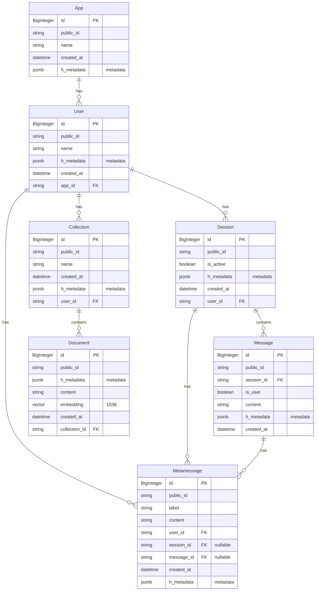

Honcho is a user context management system for AI powered applications. 
The storage concepts are inspired by, but not a 1:1 mapping of, the OpenAI 
Assistants API. The insights concepts are inspired by cognitive science, 
philosophy, and machine learning.

Honcho is open source. We believe trust and transparency are vital for
developing AI technology. We're also focused on using and supporting existing
tools rather than developing from scratch.

We focus on flexible, user-centric storage primitives to promote community 
exploration of novel memory frameworks and the usage of the 
[Dialectic API](https://blog.plasticlabs.ai/blog/Introducing-Honcho's-Dialectic-API) 
to support them. Language models are highly capable of modeling human psychology. 
By building a data management framework that is user-centric, we aim to address 
not only practical application development issues (like scaling, statefulness, 
etc.) but also kickstart exploration of the design space of what's possible 
given access to rich user models. You can read more about Honcho's origin, 
inspiration and philosophy on our [blog](https://blog.plasticlabs.ai).

## Core Primitives 

Using Honcho has the following flow:
1. Initialize your `Honcho` instance and `App`
2. Create a `User`
3. Create a `Session` for a `User`.
4. Create a `Collection` for a `User`
5. Add `Message`s to a `User`'s `Session`.
6. Add `Metamessage`s to a `User` (optional links to `Session`, `Message`)
7. Add `Document`s to a `User`'s `Collection`

### Apps

An `App` is the highest-level primitive in Honcho. It is the scope that all of your `Users` are bound to.

### Users

The `User` object is the main interface for managing a User's context. With it
you can interface with the `User`'s `Session`s and `Collections`s directly. 

### Sessions 

The `Session` object is useful for organizing your interactions with `User`s.
Different `User`s can have different sessions enabling you to neatly segment user
context. It also accepts a `location_id` parameter which can specifically
denote *where* users' sessions are taking place. 

### Messages 

Sessions are made up of `Message` objects. You can append them to sessions.
This is pretty straightforward.

### Metamessages

Success in LLM applications is dependent on elegant context management, so we 
provide a `Metamessage` object for flexible context storage and construction. Each 
`Metamessage` is tied to a `User` object via the required `user_id` argument. Keeping 
this separate from the core user-assistant message history ensures the 
insights service running ambiently is doing so on authentic ground truth
We've found this particularly useful for storing intermediate inferences, 
constructing very specific chat histories, and more. Metamessages can optionally be 
attached to sessions and/or messages, so constructing historical context for inference is 
as easy as possible.

### Collections

`Collections` are used to organize information about the `User`. These can be
thought of as stores for more global data about the `User` that spans sessions
while `Metamessages` are local to a session and the message they are linked to.

### Documents

`Documents` are the individual facts that are stored in the `Collection`. They
are stored as vector embeddings to allow for a RAG like interface. Using honcho
a developer can query a collection of documents using methods like cosine
similarity search

## Conclusion

Too often we hear developers enjoying a certain framework for building
LLM-powered applications only to see their codebase reach a level of complexity
that hits the limits of said framework. It ultimately gets abandoned and
developers implement their own solutions that without a doubt increase overhead
and maintenance. Our goal with Honcho is to provide a simple and flexible
storage framework accompanied by a smooth developer experience to ease pains
building the cumbersome parts of LLM applications. We hope this will allow
developers more freedom to explore exciting, yet-to-be-discovered areas!
