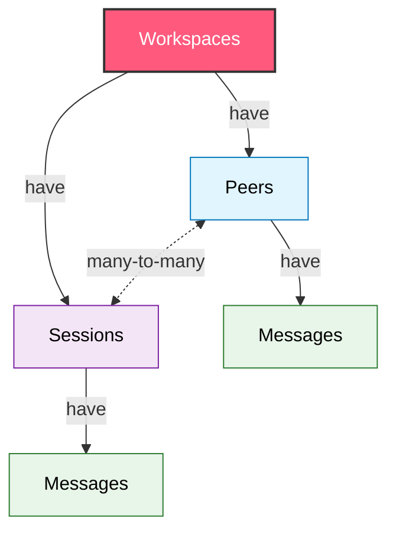

<Note> The goal of this page is to build an intuition for the primitives in Honcho and how they fit together </Note>

Honcho has 3 main components that work together to manage agent identity and context. 

- **The Storage API**: The Memory layer for storing interaction history for your agents
- **The Deriver**: The background processing layer that builds representations of users and agents
- **The Dialectic API**: The natural language API for chatting with representations

Below we'll deep dive into these different areas, discussing the data
primitives, the flow of data through the system, artifacts honcho produces, and
how to use them.


## Data Model

Honcho has a hierarchical data model centered around the entities below. 



There are `Workspaces` at the top that contain `Peers` and `Sessions`. A `Peer`
can be part of many `Sessions` and a `Session` can have many `Peers`. Both
`Sessions` and `Peers` can have `Messages` 

### <Icon icon="building" /> Workspaces

Workspaces are the top-level containers that provide complete isolation between different applications or environments; they essentially as a namespace to isolate different workloads or environments

**Key Features:**
- **Isolation**: Complete data separation between workspaces
- **Multi-tenancy**: Support multiple applications or environments  
- **Configuration**: Workspace-level settings and metadata
- **Access Control**: Authentication scoped to workspace level

**Use Cases:**
- Separate development/staging/production environments
- Multi-tenant SaaS applications
- Different product lines or use cases
- Complete data separation between teams

---

### <Icon icon="user" /> Peers

Peers are the most important entity within Honcho. Honcho itself could be considered to have a Peer-Centric architecture. 

Peers represent individual users, agents, or entities in a workspace. They are
the primary subjects for memory and context management. Treating humans and
agents the same lets us support arbitrary combinations of Peers for
multi-agent or group chat scenarios.

**Key Features:**
- **Identity**: Unique identifier within a workspace
- **Memory Storage**: Personal memory and context accumulation
- **Configuration**: Per-peer behavioral settings
- **Cross-Session Context**: Memory persists across all sessions

**Use Cases:**
- Individual users in chatbot applications
- AI agents interacting with users or other agents
- Customer profiles in support systems
- Student profiles in educational platforms
- NPCs in role-playing games

---

### <Icon icon="message" /> Sessions

Sessions represent individual conversation threads or interaction contexts between peers.

**Key Features:**
- **Multi-Peer**: Support multiple peers in a single session
- **Temporal Boundaries**: Clear start/end to conversation threads
- **Context Scoping**: Session-specific memory and context
- **Configuration**: Session-level behavioral controls

**Use Cases:**
- Individual chat conversations
- Support tickets
- Meeting transcripts
- Learning sessions

---

### <Icon icon="envelope" /> Messages

Messages are the fundamental units of interaction within sessions. They may
also be used at the peer level to ingest information of any kind that is not related to a specific interaction, but provides
important context for a peer (emails, docs, files, etc.).

**Key Features:** 
- **Rich Content**: Support for text, metadata, and structured data
- **Attribution**: Clear association with sending peer
- **Ordering**: Chronological sequence within sessions
- **Processing**: Automatic background analysis and insight derivation

**Message Types:**
- User messages
- AI responses
- System notifications
- Rich media content
- User actions (clicked, reacted, etc.)


## Deriver

At the core of developing representations of Peers, we have the Deriver. The
Deriver refers to a set of processes in honcho that enqueue new messages sent
by peers and reasons over them to extract facts, insights, and context.

Depending on the configuration of a `Peer` or `Session` the deriver will behave
differently and update different representations.

Facts derived here are used in the Dialectic chat endpoint to generate
context-aware responses that can correctly reference both concrete facts
extracted from messages and social insights deduced from facts, tone, and
opinion.  

<Info>
Deriver tasks are processed in parallel, but tasks affecting the same peer representation will always be processed serially in order of message creation, so as to properly understand their cumulative effect.
</Info>

There are two types of tasks that the deriver currently does:

- **Representation Tasks**: Generate/update peer representations
- **Summary Tasks**: Generate conversation summaries

### Peer Representations

Peer representations are more of an abstract concept, as they are made up of
various pieces of data stored throughout Honcho. There are however
multiple types of representations that Honcho can produce. 

Honcho handles both **local** and **global** representations of Peers, where
**local** representations are specific to a single Peer's view of another Peer,
while Global Representations are based on any message ever produced by a Peer. 


Everything is framed with regards to perspective. Alice owns its own global
representation, but it has a local representation of Bob based on what Alice
observes and similarly Bob has a global representation of itself and local
representation of Alice. So in the example above, when Alice sends a message to
Bob it triggers an update to both Alice's global representation and Bob's local
representation. 

If Alice were to have another conversation with a different Peer, Nico, and
sent them a message, then it would trigger an update to Alice's Global
Representation and Nico's local representation of Alice. Bob's local
representation of Alice would not change since Bob would never receive that
message.

<Note>By default, local representations are disabled, but can be enabled in a
Peer or Session level configuration</Note>

Depending on the use case, a developer may choose to only use global
representation, only use local, or a combination.

### Summary

Summary tasks create conversation summaries. Periodically, a
"short" summary will be created for each session as messages are added -- every
20 messages by default. "Long" summaries are created every 60 messages by
default and maintain a total overview of the session by including the previous
summary in a recursive fashion. These summaries are accessed in the
`get_context` endpoint along with recent messages, allowing developers to
easily fetch everything necessary to generate the next LLM completion for an
agent.

The system defaults are also the checkpoints used on the managed version of
Honcho hosted at [https://api.honcho.dev](https://api.honcho.dev)


## Dialectic API

The Dialectic API is one of the most integral components of Honcho and acts as
the main way to leverage Peer Representations. By using the `/chat` endpoint
developers can directly talk to Honcho about any Peer in a workspace to get
insights into the psychology of a Peer and help them steer their behavior.

This allows us to use this one endpoint for a wide variety of use cases. Model
steering, personalization, hydrating a prompt, etc. Additionally, since the
endpoint works through natural language a developer can allow an agent to
backchannel directly with Honcho, via MCP or a direct API call.

Developers should frame the Dialectic as talking an expert on the Peer rather than the Peer itself, meaning:

```python
alice.chat("What is alice's mood like") # ✅ Correct

alice.chat("What is your mood like") # ❌ Wrong
```

<Note>
Think of Dialectic Chat as an assisting agent that your main agent can consult for contextual information about any actor in your application.
</Note>

## Next Steps

<CardGroup cols={2}>
  <Card title="Platform SDK" icon="code" href="/v2/documentation/platform/sdk">
    Learn how to use the SDK to interact with the data model
  </Card>
  <Card title="Glossary" icon="book" href="/v2/documentation/core-concepts/glossary">
    Reference for all technical terms and concepts
  </Card>
  <Card title="API Reference" icon="play" href="/v2/api-reference/introduction">
    Detailed API documentation and examples
  </Card>
  <Card title="Quick Start" icon="rocket" href="/v2/documentation/introduction/quickstart">
    Get started with your first integration
  </Card>
</CardGroup>
