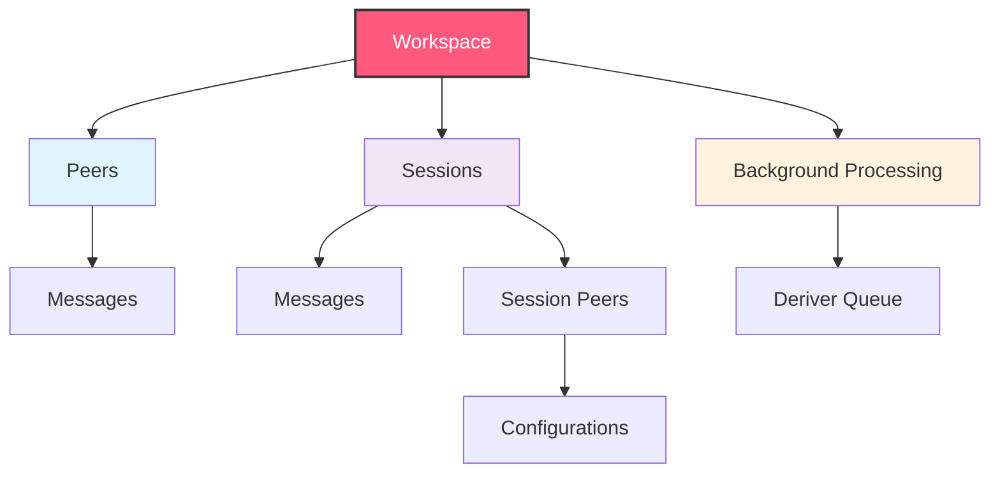

Honcho is built around a hierarchical data model that enables scalable memory management for AI applications. Understanding these core concepts is essential for effectively using the platform.

## Data Model Overview



<Info>
See the [Storage API](/v2/api-reference/introduction) to learn how to use the data model in practice.
</Info>

## Core Concepts

<AccordionGroup>
  <Accordion title="Workspaces" icon="building">
    Workspaces are the top-level containers that provide complete isolation between different applications or environments.

    **Key Features:**
    - **Isolation**: Complete data separation between workspaces
    - **Multi-tenancy**: Support multiple applications or environments  
    - **Configuration**: Workspace-level settings and metadata
    - **Access Control**: Authentication scoped to workspace level

    **Use Cases:**
    - Separate development/staging/production environments
    - Multi-tenant SaaS applications
    - Different product lines or use cases
    - Complete data separation between teams

    ```json
    {
      "name": "my-production-app",
      "metadata": {
        "environment": "production",
        "version": "1.0.0"
      },
      "configuration": {
        "deriver_enabled": true
      }
    }
    ```
  </Accordion>

  <Accordion title="Peers" icon="user">
    Peers represent individual users, agents, or entities in a workspace. They are the primary subjects for memory and context management.

    **Key Features:**
    - **Identity**: Unique identifier within a workspace
    - **Memory Storage**: Personal memory and context accumulation
    - **Configuration**: Per-peer behavioral settings
    - **Cross-Session Context**: Memory persists across all sessions

    **Use Cases:**
    - Individual users in chatbot applications
    - AI agents interacting with users or other agents
    - Customer profiles in support systems
    - Student profiles in educational platforms

    ```json
    {
      "name": "user-123",
      "metadata": {
        "email": "user@example.com",
        "preferences": {
          "language": "en",
          "timezone": "UTC"
        }
      },
      "configuration": {
        "observe_me": true
      }
    }
    ```
  </Accordion>

  <Accordion title="Sessions" icon="message">
    Sessions represent individual conversation threads or interaction contexts between peers.

    **Key Features:**
    - **Multi-Peer**: Support multiple peers in a single session
    - **Temporal Boundaries**: Clear start/end to conversation threads
    - **Context Scoping**: Session-specific memory and context
    - **Configuration**: Session-level behavioral controls

    **Use Cases:**
    - Individual chat conversations
    - Support tickets
    - Meeting transcripts
    - Learning sessions

    ```json
    {
      "id": "conversation-456",
      "peers": {
        "user-123": {
          "observe_others": true,
          "observe_me": true
        },
        "assistant-ai": {
          "observe_others": false,
          "observe_me": false
        }
      },
      "metadata": {
        "topic": "product-support",
        "priority": "high"
      }
    }
    ```
  </Accordion>

  <Accordion title="Messages" icon="envelope">
    Messages are the fundamental units of interaction within sessions. They may also be used at the peer level to represent stored information of any kind.

    **Key Features:**
    - **Rich Content**: Support for text, metadata, and structured data
    - **Attribution**: Clear association with sending peer
    - **Ordering**: Chronological sequence within sessions
    - **Processing**: Automatic background analysis and insight derivation

    **Message Types:**
    - User messages
    - AI responses
    - System notifications
    - Rich media content

    ```json
    {
      "content": "I need help with my order",
      "peer_id": "user-123",
      "metadata": {
        "intent": "support_request",
        "urgency": "medium",
        "order_id": "12345"
      }
    }
    ```
  </Accordion>
</AccordionGroup>

## Deriver System

### Deriver Queue

The deriver system provides automatic background processing of user interactions to derive facts, insights, and context. Messages ingested by Honcho are automatically queued for background processing by the deriver. Depending on the configuration of peer that authored the message and the session in which the message is created, the deriver may enqueue the message multiple times -- we can store facts derived from the message in the peer's global representation, their session-level representation, and/or the representations of other peers observing the author.

Facts derived here are used in the Dialectic chat endpoint to generate context-aware responses that can correctly reference both concrete facts extracted from messages and social insights deduced from facts, tone, and opinion.  

<Info>
Deriver tasks are processed in parallel, but tasks affecting the same peer representation will always be processed serially in order of message creation, so as to properly understand their cumulative effect.
</Info>

### Deriver Tasks

#### Representation

Representation tasks generate peer representations. They may be enqueued for each peer that observes a message, depending on configuration. Representations are accessed via the `chat` endpoint, allowing developers to query a peer's representation: from the "omnipresent" perspective of Honcho, the session-level representation, and the representation of that peer *from the perspective of other peers*.

Representation tasks create comprehensive user profiles including:

**Psychological Insights:**
- Personality traits
- Communication style
- Preferences and interests
- Behavioral patterns

**Contextual Information:**
- Current conversation topics
- User goals and objectives
- Emotional state indicators
- Relationship dynamics

**Example Output:**
```
The user demonstrates high technical competency and prefers direct communication. 
They show interest in software development topics and value efficiency in conversations. 
Current session indicates they're seeking help with API integration issues.
```

#### Summary

Summary tasks create conversation summaries and key insights. Periodically, a "short" summary will be created for each session as messages are added -- every 20 messages by default. "Long" summaries are created every 60 messages by default and maintain a total overview of the session by including the previous summary in a recursive fashion. These summaries are accessed in the `get_context` endpoint along with recent messages, allowing developers to easily fetch everything necessary to generate the next LLM completion for an agent.

## Dialectic Chat

Honcho's killer feature is the `chat` endpoint. By storing messages in Honcho, you may query in natural language to get intelligent answer's about a user or agent's personality, theory of mind, history, and more. Dialectic Chat should be thought of as an assisting agent which your agent can reach out to for useful context and answers about actors, human or AI, operating your application.

<Note>
Think of Dialectic Chat as an assisting agent that your main agent can consult for contextual information about any actor in your application.
</Note>

[TODO: Describe RSR / new dialectic + deriver architecture here when it's finalized]

## Scalability Considerations

- **Stateless API**: Scale API servers independently
- **Queue Workers**: Scale background processing workers
- **Database**: PostgreSQL with read replicas

## Security Architecture

- **JWTs**: Secure API access
- **Scoped Access**: Workspace/peer/session level permissions
- **Admin Controls**: Super-user capabilities
- **Workspace Isolation**: Complete data separation
- **Encryption**: Data encryption at rest and in transit

## Next Steps

<CardGroup cols={2}>
  <Card title="Platform SDK" icon="code" href="/v2/documentation/platform/sdk">
    Learn how to use the SDK to interact with the data model
  </Card>
  <Card title="Glossary" icon="book" href="/v2/documentation/core-concepts/glossary">
    Reference for all technical terms and concepts
  </Card>
  <Card title="API Reference" icon="api" href="/v2/api-reference/introduction">
    Detailed API documentation and examples
  </Card>
  <Card title="Quick Start" icon="rocket" href="/v2/documentation/introduction/quickstart">
    Get started with your first integration
  </Card>
</CardGroup>
