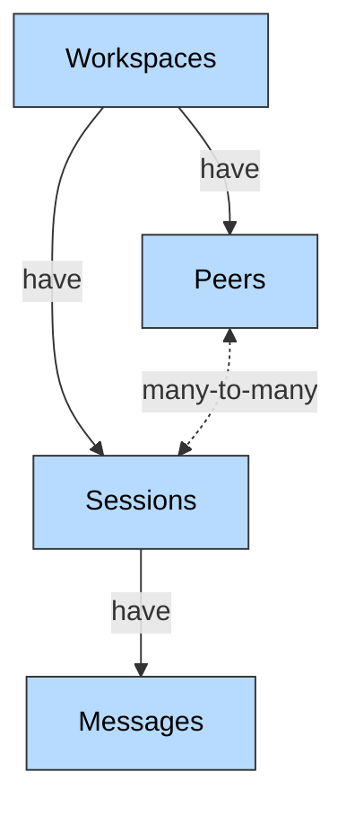

<Note> The goal of this page is to build an intuition for the primitives in Honcho and how they fit together </Note>

Honcho has 2 main components that work together to manage agent context and memory.

- **The Context Layer**: For storing and retrieving interaction history for your agents.
- **The Memory Layer**: Background processing that builds representations of users and agents.

## Data Model

Honcho has a hierarchical data model centered around the entities below.

<div style={{ display: 'flex', justifyContent: 'center' }}>

</div>

- A `Workspace` has `Peers` & `Sessions`
- A `Peer` can be in multiple `Sessions` and can send `Messages` in a `Session`.
- A `Session` can have many `Peers` and stores `Messages` sent by its `Peers`.

---

<div style={{ display: 'flex', alignItems: 'center', gap: '8px' }}>
  <Icon icon="building" />
  <h3 style={{ margin: 0 }}>Workspaces</h3>
</div>

Workspaces are the top-level containers that provide complete isolation between different applications or environments; they essentially serve as a namespace to isolate different workloads or environments.


**Key Features:**
- **Isolation**: Complete data separation between workspaces
- **Multi-tenancy**: Support multiple applications or environments
- **Configuration**: Workspace-level settings and metadata
- **Access Control**: Authentication scoped to workspace level

**Use Cases:**
- Separate development/staging/production environments
- Multi-tenant SaaS applications
- Different product lines or use cases
- Complete data separation between teams

---

<div style={{ display: 'flex', alignItems: 'center', gap: '8px' }}>
  <Icon icon="user" />
  <h3 style={{ margin: 0 }}>Peers</h3>
</div>

Honcho has a Peer-Centric Architecture: Peers are the most important entity within Honcho, with everything revolving around Peers and their representations.

Peers represent individual users, agents, or entities in a workspace. They are
the primary subjects for memory and context management. Treating humans and
agents the same lets us support arbitrary combinations of Peers for
multi-agent or group chat scenarios.

**Key Features:**
- **Identity**: Unique identifier within a workspace
- **Memory Storage**: Personal memory and context accumulation
- **Configuration**: Per-peer behavioral settings
- **Cross-Session Context**: Memory persists across all sessions

**Use Cases:**
- Individual users in chatbot applications
- AI agents interacting with users or other agents
- Customer profiles in support systems
- Student profiles in educational platforms
- NPCs in role-playing games

---

<div style={{ display: 'flex', alignItems: 'center', gap: '8px' }}>
  <Icon icon="message" />
  <h3 style={{ margin: 0 }}>Sessions</h3>
</div>

Sessions represent individual conversation threads or interaction contexts between peers.

**Key Features:**
- **Multi-Peer**: Support multiple peers in a single session
- **Temporal Boundaries**: Clear start/end to conversation threads
- **Context Scoping**: Session-specific memory and context
- **Configuration**: Session-level behavioral controls

**Use Cases:**
- Individual chat conversations
- Support tickets
- Meeting transcripts
- Learning sessions
- Single-Peer onboarding sessions where data is imported from an external source

---

<div style={{ display: 'flex', alignItems: 'center', gap: '8px' }}>
  <Icon icon="envelope" />
  <h3 style={{ margin: 0 }}>Messages</h3>
</div>

Messages are the fundamental units of interaction within sessions. They may
also be used to ingest information of any kind that is not related to a specific interaction, but provides
important context for a peer (emails, docs, files, etc.). Simple make a session
with a single peer and structure the data as messages.

**Key Features:**
- **Rich Content**: Support for text, metadata, and structured data
- **Attribution**: Clear association with sending peer
- **Ordering**: Chronological sequence within sessions
- **Processing**: Automatic background analysis and insight derivation

**Message Types:**
- User messages
- AI responses
- System notifications
- Rich media content
- User actions (clicked, reacted, etc.)
- File uploads (PDFs, text files, JSON documents)


## Reasoning Layer

The raw data you store in Honcho is useful, but it's not in a format that's most
useful for an LLM to consume. There may be too many tokens that need to be
compacted, key facts about what happened may be hard to piece together because
they involve messages from across different sessions, etc.

To solve this problem, Honcho has a reasoning layer that continually processes
incoming data to form the most informationally dense and useful representations of `Peers`
that we can then expose to agents. Honcho does the following tasks in
the reasoning engine.

- **Fact Derivation**
- **Generate Summaries**
- **Generate Peer Cards**
- **Dreaming**


Honcho will reason about each `Message` it
ingests to generate new facts and insights that are spelled out and easy to
consume in an LLM prompt.

We refer to this module of Honcho as the `Deriver`, because it's constantly
deriving new insights from messages. The sum total of all these generated
insights are what we refer to as a `Representation`, all the data related to who
and what a `Peer` is.

Depending on the configuration of a `Peer` or `Session`, the deriver will behave
differently and update different representations.

Facts derived here are used in the Dialectic chat endpoint, get_context
endpoint,

<Info>
Deriver tasks are processed in parallel, but tasks affecting the same peer representation will always be processed serially in order of message creation, so as to properly understand their cumulative effect.
</Info>

There are two types of tasks that the deriver currently does:

- **Representation Tasks**: Generate/update peer representations
- **Summary Tasks**: Generate conversation summaries

### Local & Global Representations

Peer representations are more of an abstract concept, as they are made up of
various pieces of data stored throughout Honcho. There are however
multiple types of representations that Honcho can produce.

Honcho handles both **local** and **global** representations of Peers, where
**local** representations are specific to a single Peer's view of another Peer,
while Global Representations are based on any message ever produced by a Peer.


Everything is framed with regards to perspective. Alice owns her own global
representation, but she also maintains a local representation of Bob based on what she
observes and similarly Bob has a global representation of himself and local
representation of Alice. So in the example above, when Alice sends a message to
Bob it triggers an update to both Alice's global representation of herself and Bob's local
representation of Alice.

If Alice were to have another conversation with a different Peer, Nico, and
sent them a message, this action would trigger an update to Alice's Global
Representation and Nico's local representation of Alice. Bob's local
representation of Alice would not change since Bob would never receive that
message.

<Note>By default, local representations are disabled, but can be enabled in a
Peer or Session level configuration</Note>

Depending on the use case, a developer may choose to only use global
representation, only use local, or a combination.

### Summary

Summary tasks create conversation summaries. Periodically, a
"short" summary will be created for each session as messages are added -- every
20 messages by default. "Long" summaries are created every 60 messages by
default and maintain a total overview of the session by including the previous
summary in a recursive fashion. These summaries are accessed in the
`get_context` endpoint along with recent messages, allowing developers to
easily fetch everything necessary to generate the next LLM completion for an
agent.

The system defaults are also the checkpoints used on the managed version of
Honcho hosted at [https://api.honcho.dev](https://api.honcho.dev)


## Dialectic API

The Dialectic API is one of the most integral components of Honcho and acts as
the main way to leverage Peer Representations. By using the `/chat` endpoint,
developers can directly talk to Honcho about any Peer in a workspace to get
insights into the psychology of a Peer and help them steer their behavior.

This allows us to use this one endpoint for a wide variety of use cases. Model
steering, personalization, hydrating a prompt, etc. Additionally, since the
endpoint works through natural language, a developer can allow an agent to
backchannel directly with Honcho, via MCP or a direct API call.

Developers should frame the Dialectic as talking to an expert on the Peer rather than addressing the Peer itself, meaning:

```python
alice.chat("What is the user's mood today?") # ✅ Ideal

alice.chat("What is alice's mood today?") # ✅ Works -- but make sure to consider what peer "Alice" has been saying in their messages about name/identity.

alice.chat("What is your mood today?") # ❌ Likely to fail -- the dialectic agent may conflate itself and the user.
```

<Note>
Think of Dialectic Chat as an assisting agent that your main agent can consult for contextual information about any actor in your application.
</Note>

## Next Steps

<CardGroup cols={2}>
  <Card title="Platform SDK" icon="code" href="/v2/documentation/reference/sdk">
    Learn how to use the SDK to interact with the data model
  </Card>
  <Card title="Glossary" icon="book" href="/v2/documentation/core-concepts/glossary">
    Reference for all technical terms and concepts
  </Card>
  <Card title="API Reference" icon="play" href="/v2/api-reference/introduction">
    Detailed API documentation and examples
  </Card>
  <Card title="Quickstart" icon="rocket" href="/v2/documentation/introduction/quickstart">
    Get started with your first integration
  </Card>
</CardGroup>
