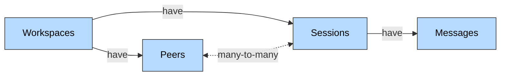

Honcho is an open source memory library with a managed service for building stateful agents. Use it with any model, framework, or architecture. You can represent any kind of entity as a stateful agent--users, AIs, groups of users, and more. Using Honcho as your memory system will earn your agents higher retention, more trust, and help you build data moats to out-compete incumbents.

<Note>
Honcho is a memory system that reasons. Read more on the approach [here](https://blog.plasticlabs.ai/blog/Memory-as-Reasoning).
</Note>

## What Can I Use Honcho For?

Honcho streamlines the agent building process by offering elegant, flexible primitives for managing context. It also reasons over that context in order to give developers access to far richer context only accessible by doing so. Take the following scenario:

- You find a use case for LLMs that you want to build an application or agent around
- It performs well but fails to retain state on the task, customers, or itself over time
- You laboriously engineer a RAG solution that seems to help
- Then a cycle like this begins...
  - Reports of edge cases, erroneous behavior, and other unpredictable problems that stem from context
  - You launch into an evals rabbithole and build internal benchmarks
  - Re-engineer your entire RAG solution
  - Repeat

All the while usage dwindles, customers churn, and motivation to solve the problem wanes. Break free from this cycle. Honcho is a general solution to solving context engineering, memory, and statefulness. 

### Context Engineering

Honcho makes it easy for developers to intitialize, store, retrieve, and scale all the LLM interaction points in your AI app or agent. It has a hierarchical data model centered around the entities below.




- A Workspace has Peers & Sessions
- A Peer can be in multiple Sessions and can send Messages in a Session.
- A Session can have many Peers and stores Messages sent by its Peers.

A [Peer](https://blog.plasticlabs.ai/blog/Beyond-the-User-Assistant-Paradigm;-Introducing-Peers) is the object Honcho uses to represent any entity--user, AI, group of people--anything you can think of as being the same from time $t$ to $t+1$. Each of the storage primitives along with peers are easy to configure and extend to fit your application's needs.

### Memory

Honcho is built around custom models that are selectively reasoning about context written to it. These models produce formal logic that powers the memory system. Each peer is the container for a *representation*(TODO: link to concept page)--the collection of reasoning that's been done over context written to it. 

<Frame>
  
</Frame>


The *deriver* (TODO: link to concept page) orchestrates all this reasoning in the background when you write messages to sessions or peers. 

Let's start with a simple implementation. 

## Quickstart

<Note>
Running the code below requires an API key. Create and account and get your API key at [app.honcho.dev](https://app.honcho.dev) under "API KEYS". 

Every new tenant gets \$100.00 in free credits on sign up. The code below costs ~\$0.04 to run, so don't worry--still plenty of free credits for iterating.
</Note>

#### 1. Install the SDK

<CodeGroup>
```bash Python (uv)
uv add honcho-ai
```

```bash Python (pip)
pip install honcho-ai
```

```bash TypeScript (npm)
npm install @honcho-ai/sdk
```

```bash TypeScript (yarn)
yarn add @honcho-ai/sdk
```

```bash TypeScript (pnpm)
pnpm add @honcho-ai/sdk
```
</CodeGroup>

#### 2. Initialize the Client

The Honcho client is the main entry point for interacting with Honcho's API. It uses a workspace called `default` unless specified, so let's create a `first-honcho-test` workspace for this quickstart.

TODO: change default environment to production, require an API key.

<CodeGroup>
```python Python
from honcho import Honcho

# Initialize client
honcho = Honcho(workspace="first-honcho-test")

```

```typescript TypeScript
import { Honcho } from '@honcho-ai/sdk';

// Initialize client
const honcho = new Honcho({ workspace = "first-honcho-test" });

```
</CodeGroup>


#### 3. Create Peers

<CodeGroup>
```python Python
user = honcho.peer("user")
assistant = honcho.peer("assistant")
```

```typescript TypeScript
const user = await honcho.peer("user")
const assistant = await honcho.peer("assistant")
```
</CodeGroup>

#### 4. Add Messages to Sessions

We've generated an example conversation dataset with 14 messages across 4 sessions. At a high level, the conversation contains a user chatting with an assistant to get help debugging software infrastructure problems for work *and* jam strategy on a side project they're working on. Spoiler alert--the user is way more interested in their side project.

Create a file called `conversation.json` and add the content in the accordion below. Then we'll loop through the sessions and messages in that file and write them to Honcho.


<Accordion title="Example conversation.json">

  ```json Example Conversation
  {
      "sessions": [
        {
          "id": "session_1",
          "messages": [
            {
              "role": "user",
              "content": "containers getting OOM killed in CI after someone on my team updated the base image. quick fix?"
            },
            {
              "role": "assistant",
              "content": "OOM kills after a base image update usually means the new image has higher memory requirements. Quick fix: bump the memory limit in your CI config. If you need to unblock fast, you could also pin back to the previous base image version temporarily."
            }
          ]
        },
        {
          "id": "session_2",
          "messages": [
            {
              "role": "user",
              "content": "hey, been playing with honcho for a side project. do you know if there's a limit on how many users i can have?"
            },
            {
              "role": "assistant",
              "content": "Honcho's free tier is based on context ingested, not number of users - so you can have as many users as you want, you're just limited by how much content you're processing. What are you building?"
            },
            {
              "role": "user",
              "content": "ok so basically it's a personal finance assistant that actually remembers your situation - like it knows you're saving for a house, that you hate subscriptions, that you always regret impulse buys over $50. i've been thinking a lot about the UX, like when should it proactively bring up past context vs wait for you to ask? and how do you balance feeling \"known\" vs feeling surveilled? i have a whole notion doc on this lol"
            },
            {
              "role": "assistant",
              "content": "That's a really thoughtful approach to the personalization problem! The \"known vs surveilled\" tension is exactly right - the best experiences feel like talking to a friend who remembers, not a system that tracks. Proactive context works best when it's in service of the user's stated goals."
            }
          ]
        },
        {
          "id": "session_3",
          "messages": [
            {
              "role": "user",
              "content": "do i need to update docker-compose too or just the CI yaml for that memory thing"
            },
            {
              "role": "assistant",
              "content": "Just the CI yaml for the memory limit - docker-compose is separate and only matters if you're hitting the same OOM issue locally."
            },
            {
              "role": "user",
              "content": "k. oh btw 3 friends are using the finance app now, they keep asking when they can pay me lol. one of them said it's the first budgeting thing that \"gets\" her"
            },
            {
              "role": "assistant",
              "content": "That's awesome - \"when can I pay you\" is the best kind of validation. And that quote about it being the first thing that \"gets\" her is exactly the value prop of personalized memory. Sounds like you're onto something real."
            }
          ]
        },
        {
          "id": "session_4",
          "messages": [
            {
              "role": "user",
              "content": "if i wanted to charge like $5/mo for the finance app, would honcho's pricing still make sense at that price point? trying to figure out unit economics early"
            },
            {
              "role": "assistant",
              "content": "You should be fine at that price point. Unlike other memory frameworks that charge you to access your own data, Honcho only charges for the reasoning layer - ingestion and inference. Storage and retrieval are free. So your unit economics are mostly about how often you're synthesizing insights, not how much history you're keeping."
            },
            {
              "role": "user",
              "content": "ok interesting. wish i had more time to work on this"
            },
            {
              "role": "assistant",
              "content": "Yeah, sounds like you've got something worth making time for. The early traction is real."
            }
          ]
        }
      ]
    }
  ```
</Accordion>


<CodeGroup>
```python Python
import json

# Load conversation data
with open("conversation.json", "r") as f:
    data = json.load(f)

# Process each session
for session_data in data["sessions"]:
    session = honcho.session(session_data["id"])
    session.add_peers([user, assistant])
    
    # Add messages with correct roles
    messages = []
    for msg in session_data["messages"]:
        if msg["role"] == "user":
            messages.append(user.message(msg["content"]))
        elif msg["role"] == "assistant":
            messages.append(assistant.message(msg["content"]))
    
    session.add_messages(messages)
```

```typescript TypeScript
import * as fs from 'fs';

const data = JSON.parse(fs.readFileSync("conversation.json", "utf-8"));

for (const sessionData of data.sessions) {
    const session = honcho.session(sessionData.id);
    session.addPeers([user, assistant]);
    
    const messages = sessionData.messages.map((msg: any) => 
        msg.role === "user" ? user.message(msg.content) : assistant.message(msg.content)
    );
    
    session.addMessages(messages);
}
```
</CodeGroup>

#### 5. Query for Insights

Now ask Honcho what it's learned - this is where the magic happens:

<CodeGroup>
```python Python
response = user.chat("What should I know about this user? 3 sentences max")
print(response)
```

```typescript TypeScript
user.chat("What should I know about this user? 3 sentences max").then((response) => {
  console.log(response);
})
```
</CodeGroup>

<Tip>
Honcho needs a short amount of time to process messages you write to it. There are several utilities to (TODO: FIX LINK) <Link href="@v2/documentation/core-concepts/features/queue-status.mdx">check the status</Link> of the queue. Honcho also offers numerous ways to query reasoning to fit latency needs.
</Tip>

The response will look something like this:

> User is a personal finance app developer building a personalized finance assistant that's generating real demand (friends are already asking when they can pay). They're notably thoughtful about product design, carefully considering the UX balance between making users feel "known" versus "surveilled" when their app proactively surfaces remembered context like savings goals and spending regrets. They're business-minded and working through unit economics early, exploring a $5/month subscription model with usage-based cost structure focused on insight generation frequency rather than data storage—though they wish they had more time to dedicate to the project.

Honcho synthesizes the signal based on the conclusions it was able to come to on the backend. Not only does it capture the basics of the conversation, but it reasons about the user to come to further conclusions. It identifies the user as "notably thoughtful about product design", "business-minded" from the discussion of unit economics, and surfaces the signal that they desire to work on the project more.

This is rich personal context for domain-specific agents to do what they want with.
- A life coach agent might see "they wish they had more time to dedicate to the project" and "friends are already asking when they can pay" and ask "have you thought about what it would take to go full-time?"
- A productivity agent might see the same pattern and say "let's protect your weekend time for the finance app."
- A financial advisor agent might see it and ask "what runway would you need to make the leap?"

Honcho acts almost like a detective--it reasons about new and existing evidence in order to form conclusions that can be used to make a *case*. These conclusions wait to be composed dynamically based on how you, the ~~judge~~ developer, query it. This approach is what drives our [pareto-frontier](TODO: link to evals page here) performance on memory benchmarks, and our custom models allow us to optimize speed and cost.


## Recap 

Let's go over what we covered and implemented:

- Became familiarized with the data model and reasoning backend of Honcho
- Signed up for the managed service, got an API key
- Wrote code to use the data model, ingested some messages, and queried the representation

<Accordion title="Full Scripts">

<CodeGroup>

```python Python
# uv sync
# uv run python test.py

import json
import time
import uuid

from honcho import Honcho
from dotenv import load_dotenv

load_dotenv()

# Initialize Honcho client with a unique workspace
workspace_id = f"docs-example-{uuid.uuid4().hex[:8]}"
honcho = Honcho(environment="production", workspace_id=workspace_id)

# Create peers to represent the user and assistant
user = honcho.peer("user")
assistant = honcho.peer("assistant")

# Load conversation data from JSON file
with open("conversation.json", "r") as f:
    conversation_data = json.load(f)

# Import historical conversation sessions
for session_data in conversation_data["sessions"]:
    session = honcho.session(session_data["id"])
    session.add_peers([user, assistant])

    # Convert messages to peer messages with correct attribution
    messages = []
    for msg in session_data["messages"]:
        if msg["role"] == "user":
            messages.append(user.message(msg["content"]))
        elif msg["role"] == "assistant":
            messages.append(assistant.message(msg["content"]))

    session.add_messages(messages)

# Wait for Honcho to process the conversation history
def wait_for_processing():
    status = honcho.get_deriver_status()
    while status.pending_work_units > 0 or status.in_progress_work_units > 0:
        time.sleep(1)
        status = honcho.poll_deriver_status()

print("Processing conversation history...")
start_time = time.time()
wait_for_processing()
elapsed = int(time.time() - start_time)
print(f"Done in {elapsed}s! Querying user insights...\n")

# Query insights about the user based on conversation history
response = user.chat("What should I know about this user? 3 sentences max")
print(response)
```

```typescript Typescript
// npm install
// npx ts-node test.ts

import * as fs from 'fs';
import { randomUUID } from 'crypto';
import * as dotenv from 'dotenv';
import { Honcho } from '@honcho-ai/sdk';

dotenv.config();

// Initialize Honcho client with a unique workspace
const workspaceId = `docs-example-${randomUUID().slice(0, 8)}`;
const honcho = new Honcho({
  environment: "production",
  workspaceId,
});

// Create peers to represent the user and assistant
const user = await honcho.peer("user");
const assistant = await honcho.peer("assistant");

// Load conversation data from JSON file
const conversationData = JSON.parse(fs.readFileSync("conversation.json", "utf-8"));

// Import historical conversation sessions
for (const sessionData of conversationData.sessions) {
  const session = await honcho.session(sessionData.id);
  await session.addPeers([user, assistant]);

  // Convert messages to peer messages with correct attribution
  const messages = [];
  for (const msg of sessionData.messages) {
    if (msg.role === "user") {
      messages.push(user.message(msg.content));
    } else if (msg.role === "assistant") {
      messages.push(assistant.message(msg.content));
    }
  }

  await session.addMessages(messages);
}

// Wait for Honcho to process the conversation history
async function waitForProcessing() {
  let status = await honcho.getDeriverStatus();
  while (status.pendingWorkUnits > 0 || status.inProgressWorkUnits > 0) {
    await new Promise(resolve => setTimeout(resolve, 1000));
    status = await honcho.pollDeriverStatus();
  }
}

console.log("Processing conversation history...");
const startTime = Date.now();
await waitForProcessing();
const elapsed = Math.floor((Date.now() - startTime) / 1000);
console.log(`Done in ${elapsed}s! Querying user insights...\n`);

// Query insights about the user based on conversation history
const response = await user.chat("What should I know about this user? 3 sentences max");
console.log(response);

```
</CodeGroup>

</Accordion>

We're just scratching the surface. The data objects have a number of cool features that make building stateful agents easier. There are several ways to query both context and reasoning in order to power memory for agents. And everything has been built with the intention of giving the developer maximum control--leverage as much or as little of the reasoning as you want, tightly control token usage, latency, and more. 

Welcome to Honcho. We're excited to have you at the frontier of AI with us 🫡.

TODO: cards to concepts?