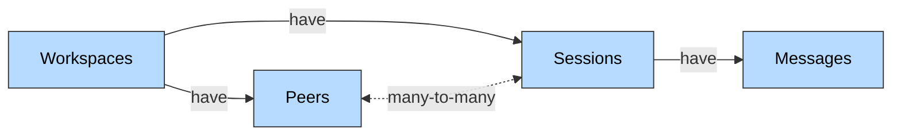

Honcho is memory infrastructure that continuously [*reasons*](/v3/documentation/core-concepts/reasoning) about data to build rich representations of peers (users, agents, or any entity) over time. This document explains the data model, system components, and how data flows through Honcho.

## Data Model

Honcho has a hierarchical data model centered around the entities below.

- A Workspace has Peers & Sessions
- A Peer can be in multiple Sessions and can send Messages in a Session
- A Session can have many Peers and stores Messages sent by its Peers

### <Icon icon="building" /> Workspaces

Workspaces are the top-level containers in Honcho. They provide complete isolation between different applications or environments, essentially serving as a namespace to keep different workloads separate. You might use separate workspaces for development, staging, and production environments, or to isolate different product lines. They also enable multi-tenant SaaS applications where each customer gets their own isolated workspace with complete data separation.

Authentication is scoped to the workspace level, and configuration settings can be applied workspace-wide to control behavior across all peers and sessions within that workspace.

---

### <Icon icon="user" /> Peers

Peers are the most important entity in Honcho--everything revolves around building and maintaining their [*representations*](/v3/documentation/core-concepts/representation). A peer represents any individual user, agent, or entity in a workspace. Treating humans and agents the same way lets you build arbitrary combinations for multi-agent or group chat scenarios.

Each peer has a unique identifier within a workspace and is a container for reasoning across all their sessions. This cross-session context means conclusions drawn about a peer in one session can inform interactions in completely different sessions. Peers can be configured to control whether Honcho reasons about them.

You can use peers for any entity that persists over time--individual users in chatbot applications, AI agents interacting with users or other agents, customer profiles in support systems, student profiles in educational platforms, or even NPCs in role-playing games.

---

### <Icon icon="message" /> Sessions

Sessions represent interaction threads or contexts between peers. A session can involve multiple peers and provides temporal boundaries for when a set of interactions starts and ends. This lets you scope context and memory to specific interactions while still maintaining longer-term peer representations that span sessions.

Use sessions to scope things like support tickets, meeting transcripts, learning sessions, or conversations. You can also use single-peer sessions as a way to import external data--create a session with just one peer and structure emails, documents, or files as messages to enrich that peer's representation.

Session-level configuration gives you fine-grained control over perspective-taking behavior. You can configure whether a peer should form representations of other peers in the session, and whether other peers should form representations of them.

---

### <Icon icon="envelope" /> Messages

Messages are the fundamental units of interaction within sessions. While they typically represent back-and-forth communication between peers, you can also use messages to ingest any information that provides context--emails, documents, files, user actions, system notifications, or rich media content.

Every message is attributed to a specific peer and ordered chronologically within its session. When messages are created, they trigger automatic background reasoning that updates peer representations. Messages support rich metadata and structured data through JSONB fields, making them flexible enough to capture whatever information matters for your use case.

## Data Flow

Understanding how data moves through Honcho helps clarify the architecture.

When you create messages, they're immediately written to PostgreSQL and reasoning tasks are added to background queues. Background workers then generate logic, summaries, and new insights to improve representations. These conclusions and insights get stored in vector collections for retrieval. This async approach ensures fast writes while still providing rich reasoning capabilities.

When you need context from Honcho, you query through the "Chat" endpoint or "Get Context" endpoint. Honcho retrieves relevant conclusions from vector storage along with recent messages, then assembles everything into coherent context ready to inject into agent prompts.

The diagram above shows how agents write messages to Honcho, which triggers reasoning that updates peer representations. Agents can then query representations to get additional context for their next response. Black arrows represent read/write of regular data (messages, storage), while red arrows represent read/write of reasoned-over data (logic, peer representations).

## Configuration & Extensibility

Honcho is designed to be flexible. Settings cascade hierarchically from workspace to peer to session, so you can set defaults at the workspace level and override them for specific peers or sessions. Feature flags let you enable or disable reasoning modes, perspective tracking, and other capabilities. You can bring your own LLM provider--OpenAI, Anthropic, or custom endpoints--and metadata fields let you extend any primitive with custom JSON data. Batch operations let you create up to 100 messages in a single API call for efficient bulk ingestion.

## Design Principles

Honcho's architecture follows a few core principles. Everything revolves around building representations of peers (peer-centric). Memory isn't just storage--it's continual learning (reasoning-first). Long-lived operations happen in the background so they don't block user interactions (async by default). The system works with any LLM provider (provider-agnostic) and is built for isolation and scalability from the ground up (multi-tenant). Users and agents are both represented as peers, which enables flexible scenarios you couldn't easily model with a traditional user-assistant paradigm (unified paradigm).

## Next Steps

<CardGroup cols={2}>
  <Card title="Get an API Key" icon="key" href="https://app.honcho.dev">
    Sign up for the Honcho platform and start building
  </Card>
  <Card title="Quickstart" icon="rocket" href="/v3/documentation/introduction/quickstart">
    Get started with your first integration
  </Card>
  <Card title="Reasoning" icon="gears" href="/v3/documentation/core-concepts/reasoning">
    Learn how Honcho reasons about messages to build memory
  </Card>
  <Card title="Peer Representations" icon="user-magnifying-glass" href="/v3/documentation/core-concepts/representation">
    Understand what peer representations are and how they work
  </Card>
</CardGroup>
