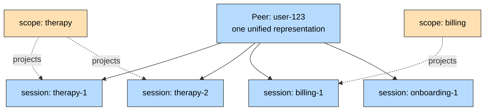
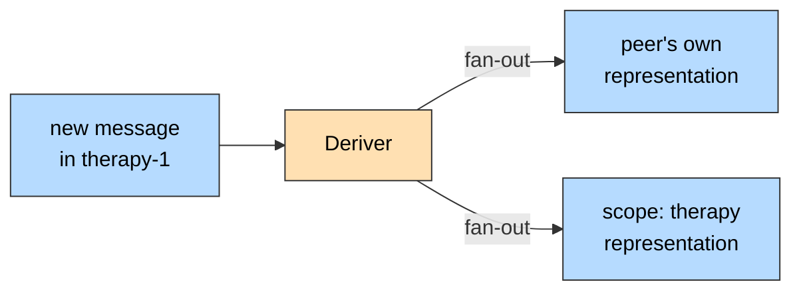
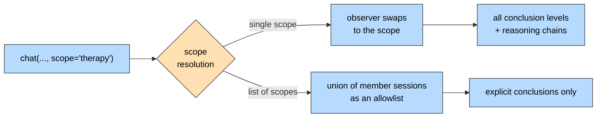

A **scope** is a named set of sessions that acts as a visibility boundary. Recall
performed through a scope sees only what happened in that scope's sessions,
while the peer keeps its single unified representation of everything it has ever
participated in.

Use scopes when one peer's history spans contexts that must not leak into each
other — a therapy app where the clinical sessions must not inform the billing
assistant, a support product where a reseller's agent may only answer from its
own tickets, a multi-tenant deployment where one human works across tenants.

## Projection, Not Partition

A scope does not split a peer into pieces. The peer's representation stays
whole; a scope is a **projection** of it — a view built only from the evidence
in that scope's member sessions.



Three consequences worth internalizing:

- **Sessions can belong to more than one scope.** Membership is many-to-many.
- **Sessions can belong to no scope.** `onboarding-1` above is reachable
  by an unscoped request and by nothing else.
- **An unscoped request still sees everything.** A scope constrains the requests
  that name it; it does not hide the sessions from requests that don't.

<Warning>
Scopes are a recall boundary, not an authorization boundary. Access can be scoped by workspace, session, or peer boundaries.
</Warning>

## The Two Arms

There are two ways to confine recall, and they behave differently. Picking the
wrong one is the most common mistake with this feature.

| | `scope="therapy"` (named scope) | `sessions=[...]` / `scope=["a","b"]` (allowlist) |
|---|---|---|
| **Mechanism** | Reads the scope's own representation of the peer | Restricts the peer's own representation to a set of sessions |
| **Conclusions** | All levels — `explicit`, plus `deductive` / `inductive` reasoned **within** the scope | `explicit` only |
| **Reasoning chains** | Available | Unavailable |
| **Setup required** | Yes — create the scope, add sessions, wait for backfill | None — pass session IDs ad hoc |
| **Accepts** | One scope name, or a list of up to 100 | Up to 1,000 session IDs |

### Named scope: depth

Passing a **single** scope name swaps the observer. Recall runs against the
scope's own view of the target peer, which the deriver and dreamer have been
building from the scope's member sessions all along. That view contains
higher-order inferences — but only ones reasoned from evidence inside the scope.

```python
answer = user.chat("What is stressing them out?", scope="therapy")
```

This is the arm you want for a durable, meaningful boundary.

### Allowlist: breadth

Passing a **list** of scopes, or a bare list of session IDs, keeps the peer as
the observer and restricts recall to the union of those sessions. Because a
dream-derived conclusion is synthesized across sessions, it cannot be attributed
to any one of them — so this arm recalls `explicit` conclusions only, and answers
from directly-stated facts rather than inference.

```python
answer = user.chat("What did they say about billing?", sessions=[s1, s2])
answer = user.chat("What did they say?", scope=["therapy", "intake"])
```

Reach for this when the set of sessions is decided per-request, or when you want
a quick boundary without provisioning a scope. See
[Scoping Recall to Sessions](/v3/documentation/features/advanced/using-filters#scoping-recall-to-sessions)
for the full allowlist rules.

<Info>
A list of scopes is the allowlist arm, not "several named scopes at once". It
gives you the union of their *sessions*, at explicit-only depth — it does not
give you the union of their reasoned views. If you need depth, query one scope.
</Info>

## Creating a Scope and Managing Membership

<CodeGroup>
```python Python
from honcho import Honcho

honcho = Honcho(workspace_id="my-app")

# Get or create — idempotent
therapy = honcho.scope("therapy")

# Add existing sessions (max 100 per call)
therapy.add_sessions(["therapy-session-1", "therapy-session-2"])

# Or attach at session creation — the scope is created if it doesn't exist
session = honcho.session("therapy-session-3", scopes=["therapy"])

# Inspect
for s in therapy.sessions():
    print(s.id)

therapy.remove_session("therapy-session-1")

for scope in honcho.scopes():
    print(scope.id, scope.metadata)
```

```typescript TypeScript
import { Honcho } from "@honcho-ai/sdk";

const honcho = new Honcho({ workspaceId: "my-app" });

// Get or create — idempotent
const therapy = await honcho.scope("therapy");

// Add existing sessions (max 100 per call)
await therapy.addSessions(["therapy-session-1", "therapy-session-2"]);

// Or attach at session creation — the scope is created if it doesn't exist
const session = await honcho.session("therapy-session-3", {
  scopes: ["therapy"],
});

// Inspect
for await (const s of await therapy.sessions()) {
  console.log(s.id);
}

await therapy.removeSession("therapy-session-1");

for await (const scope of await honcho.scopes()) {
  console.log(scope.id, scope.metadata);
}
```

```bash REST
# Get or create (201 created / 200 existing)
curl -X POST "$HONCHO_URL/v3/workspaces/my-app/scopes" \
  -H "Authorization: Bearer $HONCHO_API_KEY" \
  -H "Content-Type: application/json" \
  -d '{"id": "therapy"}'

# Add sessions
curl -X POST "$HONCHO_URL/v3/workspaces/my-app/scopes/therapy/sessions" \
  -H "Authorization: Bearer $HONCHO_API_KEY" \
  -H "Content-Type: application/json" \
  -d '{"session_ids": ["therapy-session-1", "therapy-session-2"]}'

# List membership
curl -X POST "$HONCHO_URL/v3/workspaces/my-app/scopes/therapy/sessions/list" \
  -H "Authorization: Bearer $HONCHO_API_KEY"

# Remove one session
curl -X DELETE "$HONCHO_URL/v3/workspaces/my-app/scopes/therapy/sessions/therapy-session-1" \
  -H "Authorization: Bearer $HONCHO_API_KEY"
```
</CodeGroup>

Scope IDs are unprefixed, must match `^[a-zA-Z0-9_-]+$`, and are at most 506
characters.

<Note>
Every scopes route — and every read that passes `scope` — requires a
**workspace-level or admin key**. A scope's membership can exceed any single
peer's own session membership, so peer- and session-scoped keys are rejected
with `401`.
</Note>

## Membership Changes Copy, They Don't Re-Derive

A session added to a scope while empty needs nothing special: messages sent
after the change flow into the scope through the normal deriver fan-out.



A session that **already has messages** is handled retroactively by a background
job rather than by re-running the LLM over its history: adding it enqueues a
`scope_backfill` that copies the session's existing `explicit` conclusions into
the scope's collections, and removing it enqueues a `scope_removal` that
soft-deletes those copies, follows dependent derived conclusions out
(fail-closed), and rebuilds the scope's peer card from whatever evidence remains.
Copying rather than re-deriving is why membership changes are cheap and
deterministic — and why they are also **asynchronous**.

Poll `status()` to tell "the scope hasn't caught up yet" apart from "the scope
has caught up and there is genuinely nothing to recall":

<CodeGroup>
```python Python
therapy.add_sessions(["old-session-with-history"])

status = therapy.status()
# {"old-session-with-history": {"state": "pending", "updated_at": "..."}}
# → later: {"state": "completed", "docs_copied": 42, "updated_at": "..."}
```

```typescript TypeScript
await therapy.addSessions(["old-session-with-history"]);

const status = await therapy.status();
// { "old-session-with-history": { state: "pending", updatedAt: "..." } }
```

```bash REST
curl "$HONCHO_URL/v3/workspaces/my-app/scopes/therapy/status" \
  -H "Authorization: Bearer $HONCHO_API_KEY"
```
</CodeGroup>

`state` is `pending`, `completed`, or `failed`; `docs_copied` appears once a
backfill completes. Only sessions that have had a backfill enqueued appear, so an
empty result means none have — not that the scope is empty.

## Reading Through a Scope



`scope` is accepted on four surfaces:

| Surface | Accepts | Notes |
|---------|---------|-------|
| [`peer.chat()`](/v3/documentation/features/chat) | one scope or a list | Confines both conclusion recall and the messages the agent reads |
| `peer.representation()` | one scope or a list | Confines conclusion recall |
| [`session.context()`](/v3/documentation/features/get-context) | one scope only | Perspective source for `peer_target`'s representation and card. Requires `peer_target`; mutually exclusive with `peer_perspective` |
| `honcho.search()` | one scope only | Restricts message search to the scope's member sessions |

<CodeGroup>
```python Python
# Chat — answered only from the therapy sessions
answer = user.chat("What is stressing them out?", scope="therapy")

# Representation
rep = user.representation(scope="therapy")

# Session context, using the scope as the perspective source
ctx = session.context(peer_target="user-123", scope="therapy")

# Message search, restricted to the scope's sessions
messages = honcho.search("insomnia", scope="therapy")
```

```typescript TypeScript
// Chat — answered only from the therapy sessions
const answer = await user.chat("What is stressing them out?", {
  scope: "therapy",
});

// Representation
const rep = await user.representation({ scope: "therapy" });

// Session context, using the scope as the perspective source
const ctx = await session.context({
  peerTarget: "user-123",
  scope: "therapy",
});

// Message search, restricted to the scope's sessions
const messages = await honcho.search("insomnia", { scope: "therapy" });
```

```bash REST
curl -X POST "$HONCHO_URL/v3/workspaces/my-app/peers/user-123/chat" \
  -H "Authorization: Bearer $HONCHO_API_KEY" \
  -H "Content-Type: application/json" \
  -d '{"query": "What is stressing them out?", "scope": "therapy"}'
```
</CodeGroup>

### Rules

Like the session allowlist, `scope` **fails closed** — a contradiction is
rejected rather than silently widened, and an empty boundary recalls nothing
rather than everything.

| Rule | Behavior |
|------|----------|
| `scope` with `filters` | `422` |
| `scope` with `session` / `session_id` | `422` |
| `scope` with `sessions` | `422` |
| `scope` with `peer_perspective` (context only) | `422` |
| `scope` without `peer_target` (context only) | `422` |
| `scope` with a `session_id` filter (search only) | `422` |
| A scope with no member sessions | Recalls nothing |
| An empty list (`scope=[]`) | Rejected — never treated as "no boundary" |
| More than 100 scopes in one `scope` option | `422` |
| A resolved session union over 1,000 sessions | `422` |
| A peer- or session-scoped key | `401` |

## Provenance, Not Topic

A scope is defined by **where a fact was said**, not what it is about.

If a user mentions a therapy detail in a billing session, that conclusion is
formed from the billing session and lands in the `billing` scope. Querying
`scope="therapy"` will not find it, and querying `scope="billing"` will.

<Warning>
Scopes give you provenance-based privacy, not topic-based privacy. If you need
"no clinical content in the billing assistant's answers" regardless of where it
was said, that is content classification and has to be enforced above Honcho —
by controlling what reaches which session in the first place, or by filtering
the answer.
</Warning>

Design accordingly: keep the session boundary aligned with the confidentiality
boundary you actually care about, since that session boundary is the one scopes
can enforce.

## Guardrails

A few behaviors follow from how scopes are built:

- **The `scope.` prefix is reserved.** Creating a peer, or adding a peer to a
  session, with a `scope.`-prefixed name is rejected.
- **Scopes are hidden from peer listings by default.** Pass `kind="scope"` to
  list only scopes, or `kind="all"` to see both.
- **A scope can't be observed.** No representation is formed *of* a scope, so a
  scope is rejected in any `target` / observed position, including as a dream
  target.
- **Membership is managed only through the scopes surface.** The session
  add-peers, set-peers, and remove-peers routes reject scope names and point you
  at `/scopes/{scope_id}/sessions` or the `scopes` field on session create.

Honcho is open source — if you want to understand how scopes work under the
hood, read the implementation:
[`src/routers/scopes.py`](https://github.com/plastic-labs/honcho/blob/main/src/routers/scopes.py),
[`src/crud/scope.py`](https://github.com/plastic-labs/honcho/blob/main/src/crud/scope.py),
and [`src/deriver/scope_backfill.py`](https://github.com/plastic-labs/honcho/blob/main/src/deriver/scope_backfill.py).

## Limits

| Limit | Value |
|-------|-------|
| Scope ID length | 506 characters |
| Scope ID charset | `^[a-zA-Z0-9_-]+$` |
| Sessions per membership call | 100 |
| Scopes in one `scope` read option | 100 |
| Scopes on session create | 100 |
| Sessions in a resolved allowlist | 1,000 |

Full request and response shapes are in the
[API reference](/v3/api-reference/endpoint/scopes/get-or-create-scope).
