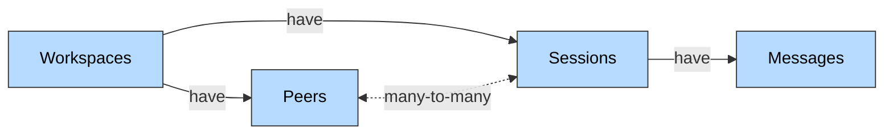

Honcho is an open source memory library with a managed service for building stateful agents. Use it with any model, framework, or architecture. It enables agents to build and maintain state about any entity--users, agents, groups, ideas, and more. And because it's a continual learning system, it understands entities that change over time. Using Honcho as your memory system will earn your agents higher retention, more trust, and help you build data moats to out-compete incumbents.

<Note>
  Honcho has defined the Pareto Frontier of Agent Memory. Watch the [video](https://x.com/honchodotdev/status/2002090546521911703?s=20), check out our [evals page](https://evals.honcho.dev/), and read the [blog post](https://blog.plasticlabs.ai/research/Benchmarking-Honcho) for more detail.
</Note>

<CardGroup cols={2}>
  <Card title="Get an API Key" icon="key" href="https://app.honcho.dev">
    Sign up and start building with Honcho
  </Card>
  <Card title="Quickstart" icon="rocket" href="/v3/documentation/introduction/quickstart">
    Build your first stateful agent in minutes
  </Card>
</CardGroup>

## Why Use Honcho?

Honcho streamlines the agent building process by offering elegant, flexible primitives for managing context. It also reasons over that context to give developers access to far richer insights only accessible through reasoning.

Take the following scenario:

- You find a use case for LLMs and build an agent around it
- It works well initially but can't maintain context across sessions
- You spend weeks engineering a RAG solution that seems to help
- Then the cycle begins...
  - Users report the agent forgetting things, contradicting itself, or losing context mid-session
  - You build evals to quantify the problem
  - You re-engineer your entire RAG pipeline with better chunking, embeddings, retrieval strategies
  - The problems shift but don't disappear
  - Repeat

Eventually you realize the issue isn't engineering—-it's that you're not extracting all the latent information from your data. You need to reason exhaustively, handle contradictions, track patterns over time, and maintain coherent state. In other words, you'd need to build Honcho.

Break free from this cycle. Honcho is a general solution to context engineering, memory, and statefulness.

## How Honcho Works

<Note>
  Honcho is a memory system that reasons. Read more on the approach [here](https://blog.plasticlabs.ai/blog/Memory-as-Reasoning).
</Note>

Honcho has four storage primitives that work together:

- **Workspaces** - Top-level containers that isolate different applications or environments
- **Peers** - Any entity that persists but changes over time (users, agents, objects, and more)
- **Sessions** - Interaction threads between peers with temporal boundaries
- **Messages** - Units of data that trigger reasoning (conversations, events, activity, documents, and more) 

When you write messages to Honcho, they're stored and processed in the background. Custom reasoning models perform formal logical [_reasoning_](/v3/documentation/core-concepts/reasoning) to generate conclusions about each peer. These conclusions are stored as [_representations_](/v3/documentation/core-concepts/representation) that you can query to provide rich context for your agents.

The diagram above shows the flow: agents write messages to Honcho, which triggers reasoning that updates what's stored in representations. Developers (or agents) can then query to get additional context for their next response.

## Why Reasoning?

Traditional RAG systems retrieve what was explicitly said, but they miss what matters most—the insights only accessible by _rigorously thinking_ about your data. Without reasoning, you're leaving latent information on the table. Static retrieval can't surface implicit connections, struggles when new information contradicts old data, and fails when you need to make predictions under uncertainty.

Honcho uses formal logic to extract all that latent information. This reasoning is AI-native—it performs the rigorous, compute-intensive thinking that humans struggle with, instantly and consistently. The result is memory that goes beyond simple RAG recall to provide exhaustive context for statefulness.

## Get Started

Honcho gives you maximum control over your agent's context and memory. The data model is flexible and composable, the reasoning backend is powerful yet cost-effective, and everything is built to give developers levers to manage token usage, latency, and reasoning depth.

We're just scratching the surface. Dive into the quickstart to see Honcho in action, explore the architecture to understand how it all fits together, or jump straight to building.

Welcome to Honcho. We're excited to have you at the frontier of AI with us 🫡.

<CardGroup cols={2}>
  <Card title="Get an API Key" icon="key" href="https://app.honcho.dev">
    Sign up for the Honcho platform and get your API key
  </Card>
  <Card title="Quickstart" icon="rocket" href="/v3/documentation/introduction/quickstart">
    Build your first stateful agent in minutes
  </Card>
  <Card title="Architecture" icon="sitemap" href="/v3/documentation/core-concepts/architecture">
    Deep dive into how Honcho's primitives fit together
  </Card>
  <Card title="Reasoning" icon="gears" href="/v3/documentation/core-concepts/reasoning">
    Learn how Honcho reasons about data to build memory
  </Card>
</CardGroup>