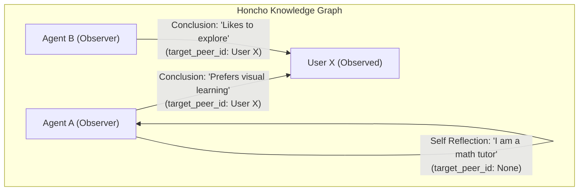
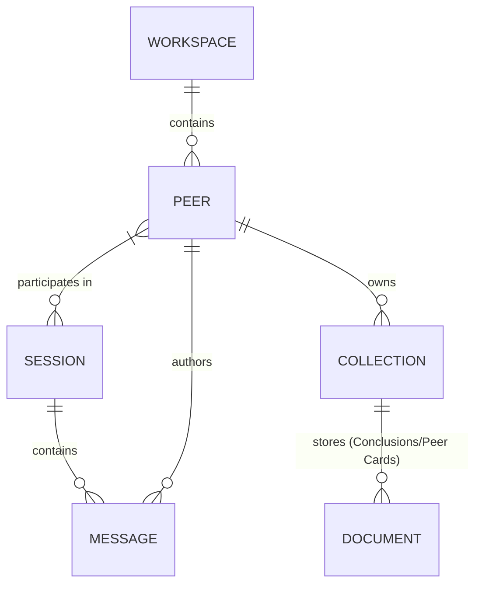
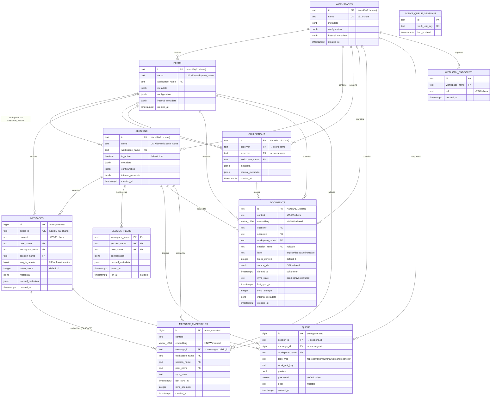

# Exploration: Honcho Philosophies, Mechanics, and Architecture

**Date:** 2026-05-07  
**Database Context:** `honcho` on `platform-postgres-1` (pgvector)  

---

## 1. The Core Philosophy of Honcho

At its heart, Honcho is designed to solve the **Agent Memory** problem. It replaces brittle, ad-hoc state tracking with a unified, relational memory backend designed natively for AI agents. 

### 1.1 The "Peer" Paradigm
Unlike traditional application architectures that split participants strictly into "Users" (humans) and "System/Assistants" (AI), Honcho models **everyone as a `Peer`**. A Peer is any participant in the system—be it a human user, an AI agent, or an external bot. 
This paradigm shift is crucial: It removes artificial boundaries, allowing complex, multi-agent, and multi-human sessions to coexist within the same interaction context.

### 1.2 Personalized, Multi-Perspective Memory
A breakthrough in Honcho's design is the concept of relational knowledge edges (the `peer_id` vs `target_peer_id` dynamic). Memory isn't stored as a single global blob. Instead:
- **`peer_id` (Observer)** forms conclusions about **`target_peer_id` (Observed)**.
- Each agent maintains its own unique "Peer Card" and "Conclusions" regarding the user. 
- The system safely models multi-dimensional subjectivity: "What does Agent A know about User X?" vs. "What does Agent B know about User X?"



---

## 2. How Honcho Works (Mechanics & Reasoning)

### 2.1 The Hierarchy
Honcho organizes data through clear, scalable primitives:
1. **Workspaces**: Top-level tenant boundaries (e.g., `hermes_workspace`). Provides total isolation.
2. **Peers**: Any entity (human or agent) operating in the workspace.
3. **Sessions**: The interaction threads connecting multiple Peers.
4. **Messages**: Atomic communication data, scoped to a Session and authored by a Peer.
5. **Conclusions & Peer Cards**: Extracted knowledge artifacts stored in internal Collections/Documents.



### 2.2 The Reasoning Engine (Dialectic & Derivation)
Honcho doesn't just passively store messages; it actively "thinks" about them.
- **Background Deriver**: As messages stream into a session, Honcho enqueues background tasks (like `representation` and `summary`) to continuously update what it knows about the peers.
- **Dreams (`mcp_honcho_schedule_dream`)**: Honcho can run offline, heavy-compute consolidation tasks (dreams) to distill long interaction logs into sharp, foundational insights.
- **The Chat API (`mcp_honcho_chat`)**: Instead of raw data retrieval, agents can query Honcho using natural language (e.g., *"What is user X like?"*). Honcho acts as an Oracle, injecting the correct conclusions and peer cards to provide a highly accurate, zero-shot assessment of the target peer.

---

## 3. Database Architecture & Schema Deep Dive

The Honcho database contains **12 tables** organized into three functional layers: Core Entities, Knowledge & Vectors, and Operations.

### 3.1 Full Entity Relationship Diagram


### 3.2 Table-by-Table Insights

#### `workspaces`
The top-level isolation boundary. Every other entity is scoped by `workspace_name`.
> **Key Insight**: All child tables reference `workspaces(name)`, NOT `workspaces(id)`. This makes the human-readable workspace name the foreign key, drastically improving debuggability.

#### `peers`
Both humans and AI agents are stored here identically. The `(name, workspace_name)` composite key is referenced by 7 other tables.
> **Key Insight**: This is why peers cannot be deleted — cascading would destroy messages, collections, documents, session memberships, and embeddings.

#### `session_peers`
The bridge enabling multi-participant sessions. Contains a `left_at` timestamp.
> **Key Insight**: The `left_at` field implements soft-removal. When you call `mcp_honcho_remove_peers_from_session`, the row isn't deleted, preserving the historical audit trail.

#### `messages`
The Atomic Communication Unit. Uses a dual ID strategy: Internal `id` (bigint) for high-performance joins with the queue, and `public_id` (NanoID) for API exposure. Has a `seq_in_session` column to guarantee absolute ordering.

#### `collections`
The Observer/Observed Knowledge Container. Contains `observer` and `observed` columns.
> **Key Insight**: Collections are created bi-directionally. When `<agent>` and `<user>` interact, 4 collections are created: each peer observing the other, plus each peer's self-reflection.

#### `documents`
The Knowledge Atoms. Contains `embedding` (vector), `level` (explicit/deductive/inductive), and `source_ids` (lineage tracking).
> **Key Insight**: The `times_derived` counter tracks how often a document was re-processed during dream cycles, allowing the system to prioritize fresh vs stale knowledge.

#### `message_embeddings`
A separate embedding table for raw messages. Features an `ON DELETE CASCADE` from `messages`.

#### `queue` & `active_queue_sessions`
The Asynchronous Brain. Contains pending tasks (`representation`, `dream`, `reconciler`). `active_queue_sessions` acts as a lightweight mutex/lock mechanism ensuring only one deriver worker processes a given session's queue at a time.

### 3.3 System Architectural Patterns
1. **The Triple Metadata Pattern**: Every core entity features three JSONB columns perfectly mirroring the MCP parameters:
   *   `metadata`: User-facing custom data.
   *   `configuration`: System behavior settings (e.g., `{"observeMe": true}`).
   *   `internal_metadata`: Reserved for internal Deriver worker state.
2. **The Dual Vector Index Strategy**: Two separate HNSW indexes serve different search use cases:
   *   `message_embeddings`: Searches raw conversation content (what was said).
   *   `documents.embedding`: Searches derived knowledge (what was learned).

### 3.4 The Data Integrity Web (Why Peers Can't Be Deleted)
Deleting a Peer would require cascading across **7 foreign key relationships**, destroying messages, session memberships, knowledge collections (both as observer and observed), derived documents, and embeddings. The system intentionally drops the `DELETE` endpoint to prevent this catastrophic orphaning.

---

## 4. Logical vs. Physical Mapping (MCP to Schema)

The architecture bridges the high-level Honcho MCP API directly to the underlying PostgreSQL tables. Below is the mental model mapping the MCP Tools (and their parameters) to the physical tables:

```text
┌────────────────────────────────────────┐           ┌────────────────────────────────────────┐
│            HONCHO MCP TOOLS            │           │       POSTGRESQL SCHEMA (dbcode)       │
│        (Logical / API Interface)       │           │          (Physical Storage)            │
├────────────────────────────────────────┤           ├────────────────────────────────────────┤
│                                        │           │                                        │
│ 1. mcp_honcho_create_peer              │──────────▶│ TABLE: peers                           │
│    (peer_id, config)                   │           │ PK: (name, workspace_name)             │
│                                        │           │                                        │
│ 2. mcp_honcho_create_session           │──────────▶│ TABLE: sessions                        │
│    (session_id)                        │           │ PK: (name, workspace_name)             │
│                                        │           │                                        │
│ 3. mcp_honcho_add_messages_to_session  │──────────▶│ TABLE: messages                        │
│    (content, peer_id)                  │     ┌────▶│ TABLE: message_embeddings              │
│                                        │     │     │                                        │
│ 4. mcp_honcho_get_peer_card            │─────┤     │ TABLE: collections                     │
│ 5. mcp_honcho_list_conclusions         │──────────▶│ TABLE: documents                       │
│    (peer_id, target_peer_id)           │           │ (level: explicit/deductive/inductive)  │
│                                        │           │                                        │
│ 6. mcp_honcho_schedule_dream           │──────────▶│ TABLE: queue                           │
│                                        │           │ (task_type: 'dream')                   │
└────────────────────────────────────────┘           └────────────────────────────────────────┘
```

Here is how logical API actions translate to physical persistence:

| Honcho MCP Tool | PostgreSQL Table Impact | Internal Action |
| :--- | :--- | :--- |
| `mcp_honcho_create_peer` / `mcp_honcho_create_session` | `peers`, `sessions` | Creates entities. The `peer_id` string becomes the `name` column in the database (used as the human-readable Foreign Key across all tables). |
| `mcp_honcho_add_messages_to_session`  | `messages`, `message_embeddings`, `queue` | Stores raw text in `messages`, queues a task for vectorization into `message_embeddings`, and enqueues a `representation` derivation task in the background. |
| `mcp_honcho_create_conclusions`       | `documents`, `collections`                | Saves the explicit conclusion in `documents` and links it to the observer/observed via the `collections` bridge table.                                       |
| `mcp_honcho_schedule_dream`           | `queue`                                   | Does not execute immediately. Creates a row with `task_type = 'dream'` for background worker processing to consolidate explicitly saved facts.               |

**Key Abstraction:** The MCP completely hides the Vector Indexing (pgvector) and Background Worker queuing (RabbitMQ/DB Queue) from the Agent. When an agent queries the Context API, it receives cleanly formatted JSON, unaware of the heavy HNSW indexing and async reconciliation occurring behind the scenes.

---

## 5. Live Data Insights (Schema vs. Reality)

We executed direct SQL queries via the `dbcode` MCP to analyze how the architecture translates into actual live data.

### 5.1 The Knowledge Graph Lineage
Querying the `documents` table reveals a complex, evolving knowledge graph rather than a strict 3-tier hierarchy:
1. **Explicit (13,901 rows)**: **The Roots.** Raw facts. As the origin points, their `source_ids` column is literally the JSON string `"null"`.
2. **Deductive (286 rows)**: **The Inferences.** When unpacking their `source_ids`, we find they point primarily to `explicit` facts (581 links), but also recursively point to other `deductive` facts (40 links) and `inductive` patterns (18 links).
3. **Inductive (287 rows)**: **The Generalizations.** Their `source_ids` also point to a mixture of `explicit` (610 links), `deductive` (102 links), and other `inductive` facts (90 links).
**Conclusion**: Honcho's reasoning engine does not use a strict `Explicit -> Deductive -> Inductive` pipeline. Instead, it continuously cross-pollinates raw facts and higher-level abstractions to form new, richer conclusions.

### 5.2 The Subjectivity Engine
This is where the `peer_id` vs `target_peer_id` paradigm materializes. Live data shows that a single chat session between `<agent>` and `<user>` generates **4 distinct collections**:
1. `<agent>` observing `<agent>` (self-reflection)
2. `<agent>` observing `<user>` (AI's view of User)
3. `<user>` observing `<agent>` (User's view of AI)
4. `<user>` observing `<user>` (self-reflection)
The database physically separates these perspectives, preventing context pollution.

### 5.3 Derived Insight Examples
When querying for `inductive` documents, the results are highly synthesized "Behavioral Profiles":
*   *"<agent> shows strong WSL2-specific operational awareness, especially around Docker management limitations..."* (Derived from 4 explicit facts)
*   *"<agent> prefers `.env`-based launcher configuration and tends to keep Claude Code startup settings in lightweight environment files..."* (Derived from 4 explicit facts)

---

## 6. Real-World Use Cases (Where Honcho Excels)

Based on these mechanics, Honcho shines in scenarios requiring continuous, deeply personalized, or multi-actor state.

### 6.1 The "Lifelong" AI Companion / Therapist
- **Why Honcho**: Standard ChatGPT-style apps lose context over time. By leveraging Honcho's background reasoning, a companion bot remembers minor preferences and personality traits without overflowing the token limit.
- **Mechanics**: It queries the Chat API to retrieve a condensed "Peer Card" representing the user before generating any response.

### 6.2 Personalized Multi-Subject Tutors
- **Why Honcho**: Imagine an ed-tech app with a Math Tutor Agent and a History Tutor Agent. 
- **Mechanics**: Both agents are `Peers` sharing the same `Workspace` and `Session` with the student. If the student tells the Math Tutor, "I'm a visual learner", the History Tutor can query that shared knowledge graph to automatically adjust its teaching style, benefiting from the Math Tutor's observation.

### 6.3 Autonomous Multi-Agent Swarms
- **Why Honcho**: In systems like SwarmClaw or Hermes where multiple agents (DevOps, QA, Leader) collaborate, they need a central source of truth for who did what.
- **Mechanics**: Honcho allows agents to query the system for context (`mcp_honcho_get_session_context`) and make logical decisions based on the explicit state of the swarm session, rather than passing massive context strings between microservices.

### 6.4 Adaptive Customer Support
- **Why Honcho**: Support bots often struggle with returning users. 
- **Mechanics**: Using Honcho, a support agent (`peer_id`) instantly pulls up conclusions about the user (`target_peer_id`) such as: "User is a premium member with high priority." The agent modifies its tone and approach autonomously.

---

## 7. Conclusion
Honcho is not just a vector database or an LLM proxy; it is a **Psychological State Engine**. It moves developers away from simply passing message histories to LLMs, to instead managing complex, evolving relationships between human and AI entities over time.
